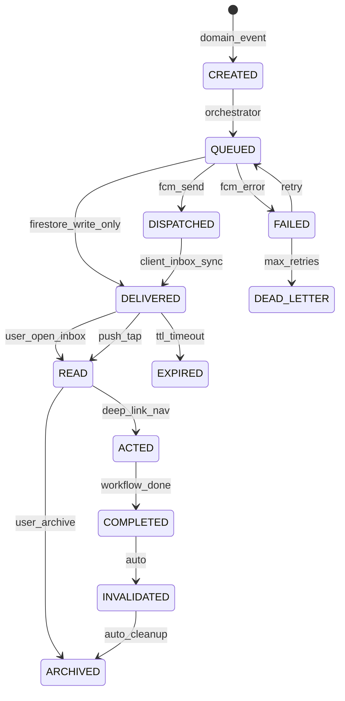
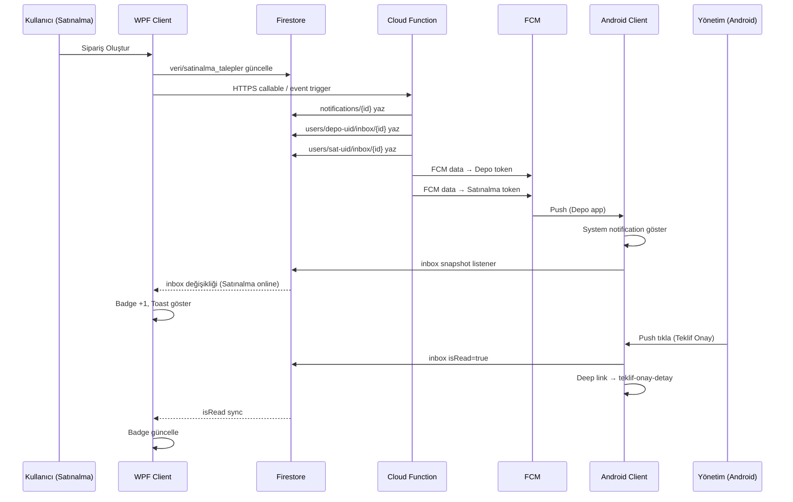
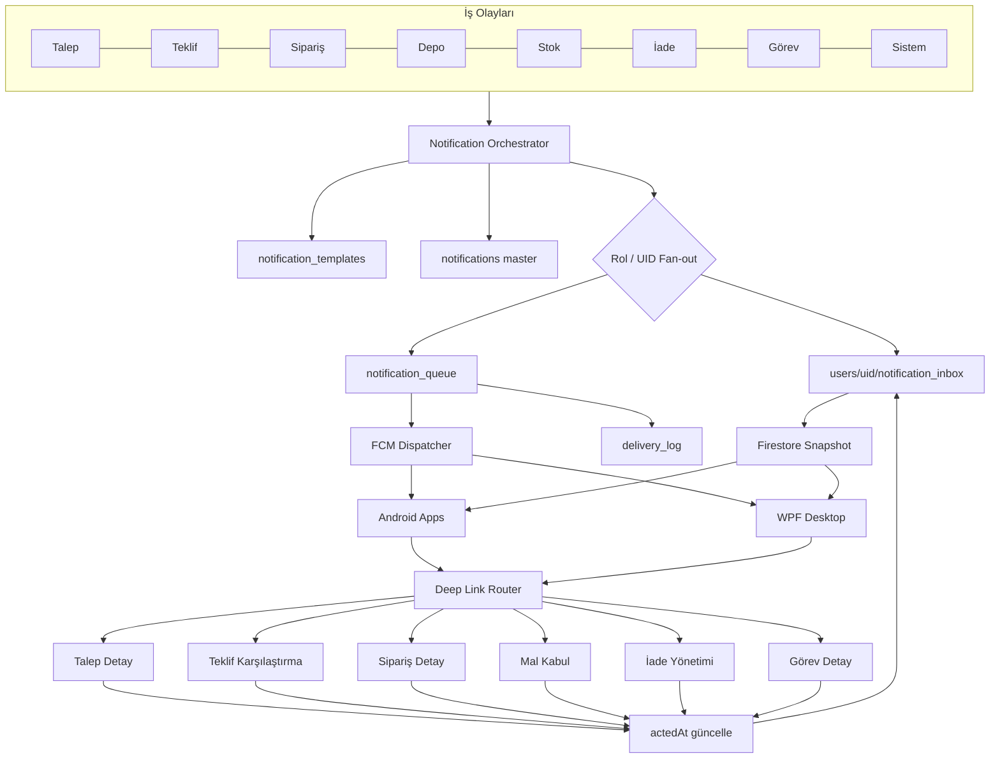

# METRİK ERP — Bildirim & Navigasyon Mimarisi

> **Sürüm:** 1.0 · 2026-07-03  
> **Rol:** Software Architect · ERP Consultant · Firebase Solution Architect  
> **Kapsam:** Android (Kotlin/Compose) · WPF Masaüstü (.NET/WPF/MVVM) · Firebase  
> **Durum:** Tasarım dokümanı — kod içermez

---

## Doküman Seti

| # | Bölüm | Bu Dosyada |
|---|-------|------------|
| 1 | Notification Architecture | §1 |
| 2 | Notification Matrix | §2 |
| 3 | Notification Lifecycle | §3 |
| 4 | Firestore Notification Collections | §4 |
| 5 | Firebase Cloud Messaging Architecture | §5 |
| 6 | Desktop Notification Architecture | §6 |
| 7 | Android Notification Architecture | §7 |
| 8 | Navigation Architecture | §8 |
| 9 | Deep Link Architecture | §9 |
| 10 | Notification Security | §10 |
| 11 | Notification Performance | §11 |
| 12 | Notification State Management | §12 |
| 13 | Notification Sequence Diagram | §13 |
| 14 | Bildirim Akış Diyagramı | §14 |
| 15 | ERP Seviyesinde Öneriler | §15 |

---

## Mevcut Durum Özeti (Gap Analizi)

| Konu | Mevcut | Hedef |
|------|--------|-------|
| Depolama | `veri/bildirimler` — tek JSON blob | Kullanıcı bazlı inbox + merkezi log |
| Payload | 5 alan FCM (`tip`, `route`, `talepId`…) | Standart 20+ alanlı ERP payload |
| Olay sayısı | 8 tip (`BildirimTipleri`) | 60+ iş olayı |
| Senkron | `okundu` bool — cihazlar arası kısmi | Cross-platform read state |
| Navigasyon | Modül + sekme + talepId | Module → Screen → Tab → Entity → Row → Action |
| Android native | Kotlin uygulamaları stub | Ortak deep link şeması |
| Geçerlilik | `GecerliMi()` talep durumuna bağlı | Lifecycle + expiry + actionRequired |

Kaynak: `BildirimRotaServisi.cs`, `BildirimKaydi.cs`, `FcmPushServisi.cs`

---

# §1 — Notification Architecture

## 1.1 Mimari Prensipler

1. **Notification as Workflow Accelerator** — Bildirim bilgi değil, aksiyon kapısıdır.
2. **Single Source of Truth** — Firestore `notification_inbox` okundu/geçmiş state'i tutar.
3. **Push + Pull Hybrid** — FCM uyandırır; Firestore listener senkronize eder.
4. **Platform Agnostic Payload** — Aynı JSON hem Android hem WPF tarafından parse edilir.
5. **Immutable Audit** — Bildirim silinmez; arşivlenir.
6. **Role-Aware Fan-out** — Cloud Function rol → kullanıcı listesi genişletir.
7. **Deep Navigation Guarantee** — Her bildirim tıklandığında kayıt + sekme + satır açılır.

## 1.2 Katmanlı Mimari

```
┌─────────────────────────────────────────────────────────────────────────┐
│                        İŞ OLAYI KATMANI                                │
│  Talep · Teklif · Sipariş · Depo · Stok · İade · Görev · Sistem        │
└───────────────────────────────┬─────────────────────────────────────────┘
                                │ Domain Event
┌───────────────────────────────▼─────────────────────────────────────────┐
│                   NOTIFICATION ORCHESTRATOR (Cloud Functions)            │
│  • Olay → şablon eşleme                                                  │
│  • Rol/UID fan-out                                                       │
│  • Öncelik + kanal belirleme                                             │
│  • notification_queue yazma                                                │
└───────────────┬───────────────────────────────┬───────────────────────────┘
                │                               │
    ┌───────────▼──────────┐        ┌───────────▼──────────┐
    │  Firestore Inbox     │        │  FCM Dispatcher       │
    │  users/{uid}/inbox   │        │  device_tokens        │
    └───────────┬──────────┘        └───────────┬──────────┘
                │ Snapshot Listener              │ Push (data-only / alert)
    ┌───────────▼──────────────────────────────▼───────────┐
    │              CLIENT RUNTIME                           │
    │  ┌─────────────────┐    ┌─────────────────────────┐ │
    │  │ Android Client  │    │ WPF Desktop Client      │ │
    │  │ • FCM Service   │    │ • Firestore poll/listen │ │
    │  │ • Inbox UI      │    │ • Action Center Toast   │ │
    │  │ • Deep Link Nav │    │ • Bildirim Merkezi      │ │
    │  └─────────────────┘    └─────────────────────────┘ │
    └───────────────────────────────────────────────────────┘
                │
    ┌───────────▼──────────┐
    │  NAVIGATION ROUTER   │  metrik://{module}/{screen}?...
    └──────────────────────┘
```

## 1.3 Bildirim Sınıfları (Tür)

| Sınıf | Kod | Kullanım | Örnek |
|-------|-----|----------|-------|
| Bilgilendirme | `INFO` | Durum değişikliği, bilgi | Talep güncellendi |
| Uyarı | `WARNING` | D tried dikkat | Kısmi teslim, eksik |
| Onay | `APPROVAL` | Karar bekliyor | Teklif onayda |
| Görev | `TASK` | Yapılacak iş | Firma aranacak |
| Sistem | `SYSTEM` | Admin/duyuru | Bakım bildirimi |
| Hata | `ERROR` | İşlem başarısız | Senkron hatası |
| Kritik | `CRITICAL` | Acil müdahale | Stok sıfır, acil talep |
| Acil | `URGENT` | SLA ihlali riski | Onay SLA aşıldı |
| Hatırlatma | `REMINDER` | Zamanlı | Görev deadline |

## 1.4 Öncelik Seviyeleri

| Öncelik | Kod | FCM Priority | Android Channel | Desktop | Ses |
|---------|-----|--------------|-----------------|---------|-----|
| Düşük | `LOW` | normal | `info` | Inbox only | Hayır |
| Orta | `MEDIUM` | normal | `operations` | Toast (sessiz) | Hayır |
| Yüksek | `HIGH` | high | `approvals` | Toast + ses | Evet |
| Kritik | `CRITICAL` | high | `critical` | Toast + ses + badge | Evet + tekrar |

---

# §2 — Notification Matrix

## 2.1 Olay Envanteri — Tüm Senaryolar

Aşağıdaki tablo hiçbir senaryoyu atlamadan tüm ERP bildirim olaylarını listeler.

**Kısaltmalar:** A=Admin, Y=Yönetim, S=Satınalma, D=Depo, Ş=Şef, Sa=Saha, At=Atölye, TS=Talep Sahibi (olusturanUid)

### A. TALEP (Request) Olayları

| # | Olay Kodu | Olay | Hedef Roller | Tür | Öncelik |
|---|-----------|------|--------------|-----|---------|
| T01 | `talep.olusturuldu` | Talep oluşturuldu | Y, S, A | INFO | MEDIUM |
| T02 | `talep.guncellendi` | Talep güncellendi | Y*, S*, TS, A | INFO | LOW |
| T03 | `talep.silindi` | Talep silindi | TS, S, A | INFO | MEDIUM |
| T04 | `talep.yonetime_gonderildi` | Yönetime gönderildi | Y, S, A | APPROVAL | HIGH |
| T05 | `talep.imza_surecinde` | İmza sürecinde | Y, S, A | INFO | MEDIUM |
| T06 | `talep.onay_bekliyor` | Yönetim onayı bekliyor | Y, A | APPROVAL | HIGH |
| T07 | `talep.acil_onay_bekliyor` | Acil talep onay bekliyor | Y, A | URGENT | CRITICAL |
| T08 | `talep.onaylandi` | Talep onaylandı | S, TS, A | INFO | MEDIUM |
| T09 | `talep.reddedildi` | Talep reddedildi | TS, S*, A | WARNING | HIGH |
| T10 | `talep.iptal_edildi` | Talep iptal edildi | TS, S, Y*, A | WARNING | MEDIUM |
| T11 | `talep.sla_yaklasiyor` | Onay SLA'si yaklaşıyor | Y, A | REMINDER | HIGH |
| T12 | `talep.sla_asildi` | Onay SLA'si aşıldı | Y, S, A | URGENT | CRITICAL |

\* Yalnızca ilgili talebe erişimi olan kullanıcılar

### B. TEKLİF (Quote) Olayları

| # | Olay Kodu | Olay | Hedef Roller | Tür | Öncelik |
|---|-----------|------|--------------|-----|---------|
| Q01 | `teklif.istendi` | Yönetim teklif istedi | S, A | TASK | HIGH |
| Q02 | `teklif.eklendi` | Teklif eklendi | S*, Y*, A | INFO | LOW |
| Q03 | `teklif.guncellendi` | Teklif güncellendi | S, Y*, A | INFO | LOW |
| Q04 | `teklif.silindi` | Teklif silindi | S, A | WARNING | MEDIUM |
| Q05 | `teklif.yonetime_gonderildi` | Teklifler yönetime gönderildi | Y, A | APPROVAL | HIGH |
| Q06 | `teklif.onay_bekliyor` | Teklif onay bekliyor | Y, A | APPROVAL | HIGH |
| Q07 | `teklif.duzeltme_istendi` | Yönetim düzeltme istedi | S, A | TASK | HIGH |
| Q08 | `teklif.firma_secildi` | Yönetim firma seçti (kalem bazlı) | S, A | INFO | MEDIUM |
| Q09 | `teklif.tum_firmalar_secildi` | Tüm kalemler için firma seçildi | S, A | INFO | MEDIUM |
| Q10 | `teklif.karsilastirma_hazir` | Karşılaştırma tablosu hazır | Y, S, A | INFO | MEDIUM |
| Q11 | `teklif.suresi_doluyor` | Teklif geçerlilik süresi doluyor | S, A | REMINDER | HIGH |

### C. SİPARİŞ (Order) Olayları

| # | Olay Kodu | Olay | Hedef Roller | Tür | Öncelik |
|---|-----------|------|--------------|-----|---------|
| O01 | `siparis.olusturuldu` | Sipariş oluşturuldu | D, S, TS, A | INFO | HIGH |
| O02 | `siparis.guncellendi` | Sipariş güncellendi | D, S, TS, A | INFO | MEDIUM |
| O03 | `siparis.iptal_edildi` | Sipariş iptal edildi | D, S, TS, Y*, A | WARNING | HIGH |
| O04 | `siparis.beklenen_olustu` | Beklenen sipariş oluştu | D, S, A | INFO | MEDIUM |
| O05 | `siparis.sevkiyatta` | Sipariş sevkiyatta | S, D, TS, A | INFO | MEDIUM |
| O06 | `siparis.revize_edildi` | Sipariş revize edildi | D, S, TS, A | WARNING | HIGH |
| O07 | `siparis.pdf_olusturuldu` | Sipariş PDF hazır | S, A | INFO | LOW |

### D. DEPO / TESLİMAT Olayları

| # | Olay Kodu | Olay | Hedef Roller | Tür | Öncelik |
|---|-----------|------|--------------|-----|---------|
| W01 | `depo.mal_kabul_yapildi` | Mal kabul yapıldı | S, TS, Y*, A | INFO | MEDIUM |
| W02 | `depo.kismi_teslim` | Kısmi teslim yapıldı | S, TS, Y*, A | WARNING | HIGH |
| W03 | `depo.tam_teslim` | Tam teslim yapıldı | S, TS, Y*, A | INFO | MEDIUM |
| W04 | `depo.eksik_teslim` | Eksik teslim oluştu | S, Y*, TS, A | WARNING | HIGH |
| W05 | `depo.fazla_teslim` | Fazla teslim oluştu | S, D, A | WARNING | MEDIUM |
| W06 | `depo.teslimat_gecikti` | Beklenen teslimat gecikti | S, D, A | REMINDER | HIGH |
| W07 | `depo.irsaliye_yuklendi` | İrsaliye yüklendi | S, A | INFO | LOW |
| W08 | `depo.fatura_yuklendi` | Fatura yüklendi | S, Y*, A | INFO | LOW |

### E. STOK Olayları

| # | Olay Kodu | Olay | Hedef Roller | Tür | Öncelik |
|---|-----------|------|--------------|-----|---------|
| ST01 | `stok.kritik_seviye` | Stok kritik seviyeye düştü | S, D, A | CRITICAL | CRITICAL |
| ST02 | `stok.tukendi` | Stok tükendi | S, D, A | CRITICAL | CRITICAL |
| ST03 | `stok.giris_yapildi` | Stok girişi yapıldı | S*, D, A | INFO | LOW |
| ST04 | `stok.cikis_yapildi` | Stok çıkışı yapıldı | S*, D, A | INFO | LOW |
| ST05 | `stok.sayim_farki` | Sayım farkı tespit edildi | S, D, A | WARNING | HIGH |
| ST06 | `stok.rezerve_edildi` | Stok rezerve edildi | S, D, A | INFO | LOW |

### F. İADE Olayları

| # | Olay Kodu | Olay | Hedef Roller | Tür | Öncelik |
|---|-----------|------|--------------|-----|---------|
| R01 | `iade.olusturuldu` | İade oluşturuldu | S, D, TS, A | WARNING | HIGH |
| R02 | `iade.onay_bekliyor` | İade onay bekliyor | Y, S, A | APPROVAL | HIGH |
| R03 | `iade.onaylandi` | İade onaylandı | S, D, TS, A | INFO | MEDIUM |
| R04 | `iade.reddedildi` | İade reddedildi | S, TS, A | WARNING | MEDIUM |
| R05 | `iade.tamamlandi` | İade tamamlandı | S, TS, A | INFO | LOW |

### G. GÖREV Olayları

| # | Olay Kodu | Olay | Hedef Roller | Tür | Öncelik |
|---|-----------|------|--------------|-----|---------|
| G01 | `gorev.atandi` | Görev atandı | Atanan UID, A | TASK | HIGH |
| G02 | `gorev.hatirlatma` | Görev hatırlatması | Atanan UID, A | REMINDER | MEDIUM |
| G03 | `gorev.tamamlandi` | Görev tamamlandı | Atayan UID, A | INFO | LOW |
| G04 | `gorev.gecikti` | Görev gecikti | Atanan UID, A | URGENT | HIGH |
| G05 | `gorev.iptal_edildi` | Görev iptal edildi | Atanan UID, A | INFO | LOW |

### H. İŞBİRLİĞİ Olayları

| # | Olay Kodu | Olay | Hedef Roller | Tür | Öncelik |
|---|-----------|------|--------------|-----|---------|
| C01 | `yorum.eklendi` | Yeni yorum eklendi | İlgili süreç rolleri, TS | INFO | LOW |
| C02 | `dosya.yuklendi` | Dosya yüklendi | S, TS*, Y*, A | INFO | LOW |
| C03 | `foto.yuklendi` | Fotoğraf yüklendi | S, TS*, A | INFO | LOW |
| C04 | `mention.yapildi` | Kullanıcı mention edildi | Mention UID | INFO | MEDIUM |

### I. KULLANICI / SİSTEM Olayları

| # | Olay Kodu | Olay | Hedef Roller | Tür | Öncelik |
|---|-----------|------|--------------|-----|---------|
| U01 | `kullanici.eklendi` | Kullanıcı eklendi | A, Yeni UID | SYSTEM | LOW |
| U02 | `kullanici.rol_degisti` | Rol değiştirildi | İlgili UID, A | SYSTEM | HIGH |
| U03 | `kullanici.pasif_edildi` | Kullanıcı pasif edildi | İlgili UID, A | SYSTEM | MEDIUM |
| U04 | `sistem.duyuru` | Sistem duyurusu | Tüm aktif kullanıcılar | SYSTEM | MEDIUM |
| U05 | `sistem.bakim` | Planlı bakım | Tüm aktif kullanıcılar | SYSTEM | HIGH |
| U06 | `sistem.hata` | Kritik sistem hatası | A | ERROR | CRITICAL |
| U07 | `senkron.tamamlandi` | Bulut senkron tamamlandı | İşlem yapan UID | INFO | LOW (silent) |
| U08 | `senkron.cakisma` | Veri çakışması | İşlem yapan UID | ERROR | HIGH |

---

## 2.2 Navigasyon Hedef Matrisi (Bildirime Tıklanınca)

| Olay Grubu | Module | Screen | Tab/Sekme | EntityType | Action |
|------------|--------|--------|-----------|------------|--------|
| Talep oluştur/güncelle | `satinalma` | `talep-detay` | Talepler | `talep` | `view` |
| Yönetime gönderildi | `satinalma` | `gelen-talepler` | Gelen Talepler | `talep` | `review` |
| Onay bekliyor | `satinalma` | `teklif-onay` / `gelen-talepler` | Onay | `talep` | `approve` |
| Reddedildi | `satinalma` | `talep-detay` / `red-talepler` | Red | `talep` | `view` |
| Teklif istendi | `satinalma` | `teklif-giris` | Teklif Girişi | `talep` | `add_quote` |
| Teklif yönetime gönderildi | `satinalma` | `teklif-onay-detay` | Teklif Onay | `talep` | `compare` |
| Firma seçildi | `satinalma` | `teklif-karsilastirma` | Karşılaştırma | `talep` | `view_selection` |
| Sipariş oluşturuldu | `satinalma` | `siparis-detay` | Siparişler | `siparis` | `view` |
| Beklenen sipariş | `satinalma` | `beklenen-siparisler` | Beklenen | `siparis` | `track` |
| Mal kabul | `depo` | `mal-kabul` | Teslimatlar | `siparis` | `receive` |
| Kısmi/Eksik teslim | `depo` | `mal-kabul` | Teslimatlar | `kalem` | `investigate` |
| Stok kritik | `stok` | `stok-durum` | Stok Durumu | `stok` | `view` |
| İade | `satinalma` | `iade-detay` | İadeler | `iade` | `manage` |
| Görev | `satinalma` | `gorev-detay` | Görevler | `gorev` | `complete` |
| Yorum/Dosya | `satinalma` | `talep-detay` | Detay/Dosyalar | `talep` | `view_attachment` |
| Sistem duyuru | `sistem` | `duyuru-detay` | — | `duyuru` | `view` |

---

## 2.3 Mevcut → Hedef Olay Eşlemesi

| Mevcut (`BildirimTipleri`) | Hedef Olay Kodu |
|----------------------------|-----------------|
| `yonetime_gonderildi` | T04 |
| `teklif_istendi` | Q01 |
| `teklif_onayda` | Q06 |
| `teklif_duzeltme_istendi` | Q07 |
| `onaylandi` | T08 / Q08 |
| `reddedildi` | T09 |
| `siparis_olusturuldu` | O01 |
| `mal_kabul_edildi` | W01 / W02 / W03 |

---

# §3 — Notification Lifecycle

## 3.1 Yaşam Döngüsü Durumları

```
CREATED → QUEUED → DISPATCHED → DELIVERED → READ → ACTED → ARCHIVED
                ↘ FAILED → RETRY → DEAD_LETTER
                ↘ EXPIRED (işlem tamamlandığında)
                ↘ INVALIDATED (talep durumu ilerlediğinde)
```

| Durum | Kod | Açıklama |
|-------|-----|----------|
| Oluşturuldu | `CREATED` | Domain event tetiklendi |
| Kuyruğa alındı | `QUEUED` | `notification_queue` kaydı |
| FCM gönderildi | `DISPATCHED` | Push API çağrıldı |
| Kullanıcıya ulaştı | `DELIVERED` | Client inbox'a yazıldı |
| Okundu | `READ` | Kullanıcı gördü / tıkladı |
| Sayfa açıldı | `ACTED` | Deep link navigasyon tamamlandı |
| İşlem tamamlandı | `COMPLETED` | İlgili workflow adımı bitti → `INVALIDATED` |
| Arşivlendi | `ARCHIVED` | Kullanıcı arşive taşıdı |
| Favorilendi | `STARRED` | Kullanıcı işaretledi |
| Süresi doldu | `EXPIRED` | TTL aşıldı |
| Geçersiz | `INVALIDATED` | `GecerliMi()` = false (mevcut mantık) |

## 3.2 Lifecycle Diyagramı



## 3.3 Otomatik Geçersiz Kılma Kuralları (Mevcut + Genişletilmiş)

Mevcut `BildirimFiltreleme.GecerliMi()` mantığı korunur ve genişletilir:

| Bildirim Tipi | Geçersiz Olur When |
|---------------|-------------------|
| `teklif_onayda` | Talep onaylandı veya reddedildi |
| `teklif_istendi` | Teklif girildi ve yönetime gönderildi |
| `yonetime_gonderildi` | Yönetim kararı verildi |
| `onaylandi` | Sipariş oluşturuldu (opsiyonel: arşivle) |
| `siparis_olusturuldu` | Tüm kalemler tam teslim |

---

# §4 — Firestore Notification Collections

## 4.1 Önerilen Koleksiyon Yapısı

Mevcut `veri/bildirimler` JSON blob **ölçeklenebilir değildir** (100K+ bildirim, 10K kullanıcı). Aşağıdaki hibrit yapı önerilir:

```
firestore/
├── users/{uid}/
│   ├── (profil alanları — mevcut)
│   ├── notification_settings/{categoryId}     ← kullanıcı tercihleri
│   └── notification_inbox/{notificationId}    ← kişisel inbox + read state
│
├── notifications/{notificationId}             ← master kayıt (immutable log)
│
├── notification_templates/{eventCode}         ← şablon (title, body, varsayılan rol)
│
├── device_tokens/{tokenId}                    ← cihaz FCM token registry
│   └── uid, platform, token, lastSeen, appVersion, active
│
├── notification_queue/{queueId}               ← Cloud Function iş kuyruğu
│   └── status, retryCount, payload, scheduledAt
│
├── notification_delivery_log/{logId}          ← FCM teslimat audit
│
├── announcements/{announcementId}             ← sistem duyuruları
│
└── veri/                                      ← mevcut operasyonel veri (talep, stok…)
    └── (migration sonrası bildirimler kaldırılır)
```

## 4.2 `notifications/{notificationId}` — Master Kayıt

| Alan | Tip | Açıklama |
|------|-----|----------|
| `id` | string (UUID) | PK |
| `eventCode` | string | `talep.olusturuldu` |
| `category` | string | `talep`, `teklif`, `siparis`, `depo`, `stok`, `iade`, `gorev`, `sistem` |
| `type` | string | INFO, APPROVAL, TASK… |
| `priority` | string | LOW, MEDIUM, HIGH, CRITICAL |
| `title` | string | |
| `message` | string | |
| `module` | string | Navigasyon |
| `screen` | string | Navigasyon |
| `entityType` | string | talep, siparis, kalem… |
| `entityId` | string | UUID |
| `parentEntityId` | string? | talepId (sipariş/kalem için) |
| `action` | string | view, approve, receive… |
| `deepLink` | string | `metrik://satinalma/talep-detay?id=…` |
| `targetRoles` | string[] | Fan-out rolleri |
| `targetUids` | string[] | Doğrudan hedef UID'ler |
| `createdBy` | string | UID |
| `createdByName` | string | |
| `createdAt` | timestamp | |
| `expiresAt` | timestamp? | TTL |
| `metadata` | map | Ek bağlam (talepNo, firmaAdi…) |
| `immutable` | boolean | true — silinemez |

## 4.3 `users/{uid}/notification_inbox/{notificationId}`

| Alan | Tip | Açıklama |
|------|-----|----------|
| `notificationId` | string | FK → notifications |
| `isRead` | boolean | Cross-platform sync |
| `readAt` | timestamp? | |
| `isArchived` | boolean | |
| `archivedAt` | timestamp? | |
| `isStarred` | boolean | Favori |
| `actedAt` | timestamp? | Deep link açıldı |
| `deliveredAt` | timestamp | Inbox'a düşme |
| `localState` | string | DELIVERED, READ, ACTED |
| `dismissedAt` | timestamp? | Toast kapatıldı (desktop) |

> **Cross-platform sync:** Okundu işareti **inbox subcollection**'da tutulur. Telefonda okunan bildirim WPF'te anında `isRead=true` görünür.

## 4.4 `notification_settings/{categoryId}`

| Alan | Tip |
|------|-----|
| `category` | string — talep, teklif, siparis, depo, gorev, iade, stok, sistem |
| `enabled` | boolean |
| `pushEnabled` | boolean |
| `soundEnabled` | boolean |
| `quietHoursStart` | string? — "22:00" |
| `quietHoursEnd` | string? — "07:00" |

## 4.5 `device_tokens/{tokenId}`

| Alan | Tip |
|------|-----|
| `uid` | string |
| `token` | string |
| `platform` | `android` \| `wpf` \| `maui` |
| `deviceId` | string |
| `appVersion` | string |
| `lastSeenAt` | timestamp |
| `active` | boolean |

---

# §5 — Firebase Cloud Messaging Architecture

## 5.1 FCM vs Firestore Listener Kararı

| Senaryo | FCM | Firestore Listener | Gerekçe |
|---------|-----|-------------------|---------|
| Onay bekleyen talep | ✓ HIGH | ✓ inbox sync | Anlık uyarı + kalıcı kayıt |
| Teklif istendi | ✓ HIGH | ✓ | Satınalma anında görmeli |
| Sipariş oluşturuldu | ✓ HIGH | ✓ | Depo uyandırılmalı |
| Mal kabul / kısmi teslim | ✓ MEDIUM | ✓ | Operasyon takibi |
| Stok kritik | ✓ CRITICAL | ✓ | Acil müdahale |
| Talep güncellendi | ✗ veya silent | ✓ | Gürültü azaltma |
| Yorum eklendi | ✗ | ✓ | Inbox yeterli |
| Dosya yüklendi | ✗ | ✓ | Düşük öncelik |
| Senkron tamamlandı | ✗ silent data | ✓ | Arka plan güncelleme |
| Stok miktar güncelleme | ✗ silent data | ✓ | Real-time UI refresh |
| Sistem duyurusu | ✓ MEDIUM | ✓ | Herkese push |
| Bildirim okundu sync | ✗ | ✓ | Sadece Firestore |
| Inbox listesi | ✗ | ✓ snapshot | Gerçek zamanlı liste |
| Badge count | ✗ | ✓ aggregate query | Platform badge |

## 5.2 FCM Mesaj Tipleri

| Tip | Kullanım | Android | WPF |
|-----|----------|---------|-----|
| **Notification message** | Uygulama kapalı/arka plan | Sistem tray | Action Center |
| **Data-only message** | Silent sync, foreground | App içi handler | Firestore poll |
| **Data + notification** | Hibrit (önerilmez) | — | — |

**Öneri:** ERP için **data-only FCM** + client-side notification rendering. Böylece navigasyon payload'u her zaman client'ta kontrol edilir.

## 5.3 FCM Payload (Data Message)

```json
{
  "v": "1",
  "notificationId": "uuid",
  "eventCode": "siparis.olusturuldu",
  "type": "INFO",
  "priority": "HIGH",
  "title": "Sipariş Oluşturuldu",
  "message": "SIP-2026-045 — XYZ Elektrik",
  "module": "satinalma",
  "screen": "siparis-detay",
  "entityType": "siparis",
  "entityId": "uuid",
  "parentEntityId": "talep-uuid",
  "action": "view",
  "deepLink": "metrik://satinalma/siparis-detay?entityId=uuid&tab=siparisler",
  "createdAt": "2026-07-03T13:00:00Z",
  "silent": "false"
}
```

## 5.4 Cloud Function Fan-out Akışı

```
1. Client veya Function → notifications/{id} yazar
2. Function → targetRoles genişletir (users sorgusu)
3. Her uid için notification_inbox/{id} yazar
4. Her aktif device_token için FCM data message gönderir
5. notification_delivery_log kaydı
6. Başarısız token → device_tokens.active = false
```

## 5.5 Android FCM Kanalları

| Kanal ID | Ad | Öncelik | Olaylar |
|----------|-----|---------|---------|
| `metrik_critical` | Kritik Uyarılar | IMPORTANCE_HIGH | ST01, ST02, T07 |
| `metrik_approvals` | Onay Bekleyen | IMPORTANCE_HIGH | T06, Q06, R02 |
| `metrik_operations` | Operasyon | IMPORTANCE_DEFAULT | O01, W01, W02 |
| `metrik_info` | Bilgilendirme | IMPORTANCE_LOW | T02, C01 |
| `metrik_system` | Sistem | IMPORTANCE_DEFAULT | U04, U05 |

---

# §6 — Desktop Notification Architecture

## 6.1 Bildirim Kanalları ve Kullanım

| Kanal | Teknoloji | Ne Zaman | Ne Zaman Değil |
|-------|-----------|----------|----------------|
| **Windows Toast (Action Center)** | `AppNotification` / WinRT | HIGH/CRITICAL, onay bekleyen, sipariş, stok kritik | LOW bilgilendirme, kendi işlemin |
| **Program içi Bildirim Merkezi** | WPF panel / `BildirimlerWindow` | Tüm bildirimler, geçmiş, arama | — |
| **Sağ alt köşe popup** | Custom WPF overlay (`MasaustuToastBildirim`) | Action Center başarısız yedek; MEDIUM öncelik | CRITICAL (Action Center tercih) |
| **Bildirim sesi** | `SystemSounds` / custom WAV | CRITICAL, URGENT, APPROVAL (HIGH) | LOW, silent sync |
| **Badge (rozet)** | Taskbar overlay + header sayaç | Okunmamis inbox count | — |

## 6.2 Masaüstü Davranış Matrisi

| Uygulama Durumu | HIGH/CRITICAL | MEDIUM | LOW/Silent |
|-----------------|---------------|--------|------------|
| Ön planda, aynı modülde | In-app banner + inbox | Inbox + subtle toast | Inbox only |
| Ön planda, farklı modülde | Toast + ses + badge | Toast + badge | Inbox + badge |
| Arka planda (minimize) | Action Center + ses | Action Center | Inbox sync |
| Kapalı | Action Center (startup) | Action Center | Sadece inbox (açılınca) |

## 6.3 Mevcut WPF Bileşenleri → Hedef

| Mevcut | Hedef Rol |
|--------|-----------|
| `BildirimYoneticisi` | Inbox orchestrator + badge |
| `MasaustuActionCenterBildirim` | PRIMARY toast (HIGH+) |
| `MasaustuToastBildirim` | FALLBACK popup |
| `BildirimlerWindow` | Notification Center UI |
| 20s polling timer | Firestore snapshot listener (primary) + polling (fallback) |

## 6.4 Bildirim Merkezi (WPF) — Özellikler

- Sol filtre: Okunmamış · Okundu · Favoriler · Arşiv
- Üst filtre: Kategori (Talep, Teklif, Sipariş, Depo, Stok, İade, Görev, Sistem)
- Arama: title, message, entityId, talepNo (metadata)
- Tarih gruplama: Bugün · Dün · Bu hafta · Eski
- Toplu işlem: Tümünü okundu · Seçilenleri arşivle
- Satır tıklama → deep link navigasyon + okundu işaretle
- Sağ panel: bildirim detayı + ilgili kayıt özeti

---

# §7 — Android Notification Architecture

## 7.1 Telefon Durumlarına Göre Davranış

| Durum | CRITICAL/HIGH | MEDIUM | LOW/Silent |
|-------|---------------|--------|------------|
| **Kilitli** | Heads-up notification + ses + lockscreen | Notification shade | Silent veya batch |
| **Açık, uygulama ön planda** | In-app snackbar/banner + inbox refresh | In-app banner | Inbox refresh only |
| **Açık, uygulama arka planda** | System notification + ses | System notification | Data sync |
| **Uygulama kapalı (force stop hariç)** | FCM → system notification | FCM → system notification | FCM data → inbox |

## 7.2 Android Bileşen Mimarisi

```
FirebaseMessagingService
    ├── onMessageReceived(data)
    │     ├── silent=true → Repository.syncInbox()
    │     └── silent=false → NotificationManager.notify()
    │                              └── PendingIntent → DeepLinkActivity
    │
NotificationRepository (Firestore listener)
    ├── users/{uid}/notification_inbox
    └── StateFlow<InboxState>
    
DeepLinkRouter
    ├── parse(metrik://...)
    ├── role guard (RBAC)
    └── NavController → Module → Screen → Entity
```

## 7.3 Kotlin Compose Navigasyon Entegrasyonu

Rol bazlı uygulamalar (Saha, Satınalma, Depo, Admin) ortak `DeepLinkRouter` modülünü paylaşır:

```
metrik://satinalma/talep-detay?entityId={uuid}&tab=talepler&highlight={kalemId}
         │         │                  │              │            │
      module    screen            entityId         tab         row focus
```

## 7.4 Foreground Service (Opsiyonel)

Depo uygulaması için beklenen sipariş takibinde:
- `IMPORTANCE_LOW` ongoing notification (SAP WM tarzı)
- Kritik stok/sevkiyat için ayrı kanal

---

# §8 — Navigation Architecture

## 8.1 Ortak Navigasyon Hiyerarşisi

```
App Root
 └── Module          (satinalma | depo | stok | sistem)
      └── Screen     (talep-detay | teklif-onay | mal-kabul | …)
           └── Tab    (talepler | teklifler | siparisler | …)
                └── Entity   (talep | siparis | kalem | iade | gorev)
                     └── Row (liste satırı highlight / scroll)
                          └── Action (view | approve | receive | edit)
```

## 8.2 Platform Route Haritası

| Deep Link Screen | Android Route | WPF Module | WPF Sekme |
|------------------|---------------|------------|-----------|
| `talep-detay` | `talep-detay?id=` | Satınalma | Taleplerim |
| `gelen-talepler` | `gelen-talepler` | Satınalma | Gelen Talepler |
| `teklif-giris` | `teklif-gir` | Satınalma | Teklif Girişi |
| `teklif-onay` | `teklif-onay` | Satınalma | Teklif Onay |
| `teklif-karsilastirma` | `teklif-karsilastirma` | Satınalma | Karşılaştırma |
| `siparis-detay` | `siparis-detay?id=` | Satınalma | Siparişler |
| `beklenen-siparisler` | `beklenen-siparisler` | Satınalma | Beklenen Siparişler |
| `mal-kabul` | `mal-kabul?id=` | Depo / Satınalma | Teslimatlar |
| `iade-detay` | `iade-detay?id=` | Satınalma | İadeler |
| `gorev-detay` | `gorev-detay?id=` | Satınalma | Görevler |
| `stok-durum` | `stok-durum` | Stok | Stok Durumu |

Kaynak (mevcut): `BildirimRotaServisi.HedefRoute()` / `MasaustuHedef()`

## 8.3 Navigation Router Sorumlulukları

1. **Parse** — deep link URI → `NavigationIntent`
2. **Authorize** — RBAC: rol bu ekrana erişebilir mi?
3. **Resolve** — entity hâlâ var mı? (Firestore fetch)
4. **Navigate** — module → screen → tab
5. **Focus** — entityId ile satır seç, detay paneli aç
6. **Mark Acted** — inbox `actedAt` güncelle

## 8.4 Bekleyen Route (Pending Navigation)

Mevcut MAUI pattern korunmalı (`BekleyenRouteAyarla`):

- Kullanıcı giriş yapmadan push gelirse → route queue
- Giriş sonrası → `BekleyenRouteIsleAsync()`
- Android: `DeepLinkActivity` → `NavController` + auth gate

---

# §9 — Deep Link Architecture

## 9.1 URI Şeması

```
metrik://{module}/{screen}?{queryParams}

Query Params (standart):
  entityType   = talep | siparis | kalem | teklif | iade | gorev | stok | duyuru
  entityId     = UUID
  parentId     = UUID (talepId for child entities)
  tab          = sekmeler
  action       = view | approve | edit | receive | compare
  highlightId  = kalem veya satır UUID
  bid          = notificationId (okundu işareti için)
  source       = push | inbox | toast
```

## 9.2 Örnek Deep Link'ler

```
metrik://satinalma/talep-detay?entityType=talep&entityId=aaa&tab=talepler&action=view&bid=nnn

metrik://satinalma/teklif-onay?entityType=talep&entityId=aaa&action=approve&bid=nnn

metrik://satinalma/teklif-karsilastirma?entityType=talep&entityId=aaa&action=compare

metrik://satinalma/siparis-detay?entityType=siparis&entityId=bbb&parentId=aaa&tab=siparisler

metrik://depo/mal-kabul?entityType=siparis&entityId=bbb&parentId=aaa&action=receive&highlightId=kalem-ccc

metrik://satinalma/iade-detay?entityType=iade&entityId=ddd&action=manage

metrik://stok/stok-durum?entityType=stok&entityId=malzeme-adı&action=view
```

## 9.3 Standart Payload Şeması (Tam)

| Alan | Tip | Zorunlu | Açıklama |
|------|-----|---------|----------|
| `notificationId` | UUID | ✓ | Bildirim PK |
| `eventCode` | string | ✓ | `talep.olusturuldu` |
| `type` | enum | ✓ | INFO, APPROVAL, TASK… |
| `category` | string | ✓ | talep, teklif, siparis… |
| `title` | string | ✓ | Görünen başlık |
| `message` | string | ✓ | Görünen mesaj |
| `module` | string | ✓ | Navigasyon modülü |
| `screen` | string | ✓ | Navigasyon ekranı |
| `entityType` | string | ✓ | Varlık tipi |
| `entityId` | string | ✓ | Birincil varlık ID |
| `parentEntityId` | string | | Üst varlık (talepId) |
| `action` | string | ✓ | Beklenen kullanıcı aksiyonu |
| `priority` | enum | ✓ | LOW, MEDIUM, HIGH, CRITICAL |
| `createdBy` | string | ✓ | UID |
| `createdByName` | string | | |
| `createdAt` | ISO8601 | ✓ | |
| `targetRoles` | string[] | * | Rol fan-out |
| `targetUsers` | string[] | * | UID fan-out |
| `isRead` | boolean | | Inbox state |
| `readAt` | ISO8601 | | |
| `deepLink` | string | ✓ | Tam URI |
| `silent` | boolean | | FCM data-only |
| `metadata` | object | | `{ talepNo, siparisNo, firmaAdi, santiye }` |
| `expiresAt` | ISO8601 | | TTL |

---

# §10 — Notification Security

## 10.1 Tehdit Modeli

| Tehdit | Risk | Önlem |
|--------|------|-------|
| Başka kullanıcının inbox'ını okuma | Yüksek | Subcollection + Security Rules |
| Bildirim spoofing | Orta | Cloud Function only write to notifications |
| FCM token çalma | Orta | Token rotation, device binding |
| Deep link privilege escalation | Yüksek | Client-side RBAC guard + server entity check |
| Mass notification abuse | Orta | Rate limiting, admin-only system events |

## 10.2 Firestore Security Rules (Taslak)

```javascript
rules_version = '2';
service cloud.firestore {
  match /databases/{database}/documents {

    function isAuth() { return request.auth != null; }
    function isOwner(uid) { return request.auth.uid == uid; }
    function isAdmin() {
      return get(/databases/$(database)/documents/users/$(request.auth.uid)).data.rol == 'Admin';
    }

    // Kullanıcı sadece kendi inbox'ını okur/yazar
    match /users/{uid}/notification_inbox/{nid} {
      allow read: if isAuth() && isOwner(uid);
      allow update: if isAuth() && isOwner(uid)
        && request.resource.data.diff(resource.data).affectedKeys()
           .hasOnly(['isRead','readAt','isArchived','archivedAt','isStarred','actedAt','dismissedAt','localState']);
      allow create, delete: if false; // sadece Cloud Function
    }

    // Ayarlar — kullanıcı kendi ayarını yönetir
    match /users/{uid}/notification_settings/{cat} {
      allow read, write: if isAuth() && isOwner(uid);
    }

    // Master bildirim — salt okunur (admin audit)
    match /notifications/{nid} {
      allow read: if isAuth() && (
        request.auth.uid in resource.data.targetUids
        || isAdmin()
      );
      allow write: if false; // Cloud Function only
    }

    // Device token — sahibi yönetir
    match /device_tokens/{tid} {
      allow read, write: if isAuth() && resource.data.uid == request.auth.uid;
      allow create: if isAuth() && request.resource.data.uid == request.auth.uid;
    }

    // Duyurular — herkes okur
    match /announcements/{aid} {
      allow read: if isAuth();
      allow write: if isAdmin();
    }
  }
}
```

## 10.3 Gizlilik Kuralları

- Satınalma teklif detayları Saha/Atölye rollerine push **metadata'sında fiyat içermemeli**
- Depo bildirimlerinde yalnızca sipariş no + malzeme adı
- `targetRoles` fan-out Cloud Function'da server-side yapılır (client manipüle edemez)

---

# §11 — Notification Performance

## 11.1 Hedef Yük

| Metrik | Değer |
|--------|-------|
| Kullanıcı | 10.000 |
| Toplam bildirim (arşiv) | 100.000+ |
| Günlük bildirim | 1.000.000 |

## 11.2 Ölçekleme Stratejileri

| Sorun | Çözüm |
|-------|-------|
| JSON blob limit | Kullanıcı bazlı subcollection |
| Inbox sorgu yavaşlığı | `orderBy deliveredAt desc` + `limit(50)` pagination |
| 100K+ arşiv | `isArchived=true` ayrı sorgu; 90 gün sonra Cold Storage (BigQuery export) |
| Rol fan-out 10K user | Cloud Function batch write (500/batch) |
| FCM 1M/gün | Cloud Tasks queue + rate limit (FCM 600K/dk limit) |
| Listener maliyeti | Inbox listener scope dar; operasyonel veri ayrı |
| Badge count | Cloud Function `unreadCount` denormalize alan (users/{uid}.unreadNotificationCount) |
| Duplicate push | `notificationId` idempotency key |

## 11.3 İndeksler

```
notification_inbox: (deliveredAt DESC) + (isRead ASC)
notification_inbox: (category ASC, deliveredAt DESC)
notifications: (createdAt DESC) — admin audit
device_tokens: (uid ASC, active ASC)
```

## 11.4 TTL ve Arşiv Politikası

| Veri | Saklama | Aksiyon |
|------|---------|---------|
| Inbox (aktif) | Süresiz | Arşivlenir, silinmez |
| Inbox (arşiv) | 2 yıl | BigQuery export |
| delivery_log | 90 gün | Otomatik sil |
| notification_queue | 7 gün | Tamamlanan sil |

---

# §12 — Notification State Management

## 12.1 Cross-Platform State Model

```
NotificationState {
  notificationId
  localState: DELIVERED | READ | ACTED | ARCHIVED | DISMISSED
  isRead: boolean          ← source of truth (Firestore inbox)
  isStarred: boolean
  isArchived: boolean
  unreadCount: int         ← denormalized on user doc
  lastSyncedAt: timestamp
}
```

## 12.2 Senkronizasyon Kuralları

| Olay | Android | WPF | Firestore |
|------|---------|-----|-----------|
| Push geldi | Local notify + inbox fetch | Toast + inbox fetch | inbox CREATED |
| Inbox açıldı | Snapshot listener | Snapshot listener | — |
| Bildirime tıklandı | isRead=true, navigate | isRead=true, navigate | inbox UPDATE |
| Toast kapatıldı (desktop) | — | dismissedAt | inbox UPDATE |
| Tümünü okundu | Batch update | Batch update | inbox BATCH |
| Telefonda okundu | — | Anlık yansır | isRead sync |
| Masaüstünde açıldı | Anlık yansır | — | actedAt sync |

## 12.3 Çakışma Çözümü

- `guncellemeUtc` (mevcut) → `readAt` / `localState` için **last-write-wins**
- Okundu işareti her zaman **true** yönünde birleşir (merge: `isRead = isRead || remote.isRead`)

---

# §13 — Notification Sequence Diagram



---

# §14 — Bildirim Akış Diyagramı



---

# §15 — ERP Seviyesinde Profesyonel Öneriler

## 15.1 SAP / Oracle / Dynamics / Logo / Netsis Karşılaştırması

| ERP | Bildirim Modeli | METRİK Önerisi |
|-----|-----------------|----------------|
| **SAP** | SAP Business Workplace + Workflow inbox (SWI1) | Rol bazlı **inbox** + onay workitem |
| **Oracle** | Oracle Notifications (Workflow AF) | Event-driven fan-out + action URL |
| **Dynamics 365** | Action Center + Power Automate alerts | Unified deep link + Activity feed |
| **Logo Tiger** | Onay kuyruğu + mobil push | Türkçe onay bildirimleri, talep no odaklı |
| **Netsis** | Modül içi uyarı + e-posta | FCM + e-posta paralel (kritik onaylar) |

## 15.2 ERP Best Practice Önerileri

1. **Work Item Pattern** — Onay bildirimleri (`APPROVAL` type) inbox'ta "Onayla / Reddet" quick action içermeli (Android notification action button, WPF context menu).

2. **SLA Timer Notifications** — T07/T11/T12 olayları için Cloud Scheduler; Logo/SAP'taki "escalation" mantığı.

3. **Aggregation / Digest** — 5 dakikada 10 düşük öncelikli bildirim → tek "10 yeni güncelleme" özeti (Dynamics Activity Feed tarzı).

4. **Notification vs Email Matrix** — CRITICAL/APPROVAL → Push + E-posta; INFO → yalnızca Push/Inbox.

5. **Entity-Centric Navigation** — SAP transaction code mantığı: her bildirim bir "transaction" (deep link) açar.

6. **Segregation of Duties** — Oluşturan kendi bildirimini toast olarak görmemeli (mevcut `ToastGosterilmeli` kuralı korunmalı).

7. **Audit Trail** — `notifications` master koleksiyonu silinmez; SOX/ISO uyumu.

8. **Multi-Device Coherence** — Dynamics "seen across devices" pattern; inbox subcollection ile.

9. **Quiet Hours** — Logo/Netsis kullanıcı profili; `notification_settings.quietHours`.

10. **Operational Dashboard Integration** — Satınalma Merkezi KPI kartları inbox count ile beslenmeli (Bekleyen Onay = unread APPROVAL count).

## 15.3 Migrasyon Yol Haritası

| Faz | Süre | İş |
|-----|------|-----|
| **Faz 1** | 2-3 hf | Standart payload + deep link şeması; mevcut 8 tip genişlet |
| **Faz 2** | 3-4 hf | `notification_inbox` subcollection; cross-platform read sync |
| **Faz 3** | 2-3 hf | Cloud Function fan-out; FCM data-only |
| **Faz 4** | 2 hf | Bildirim Merkezi UI (WPF + Android Compose) |
| **Faz 5** | 2 hf | notification_settings; quiet hours |
| **Faz 6** | 3-4 hf | Yeni olaylar (iade, görev, stok kritik); SLA timer |
| **Faz 7** | 2 hf | `veri/bildirimler` migration + deprecate |

## 15.4 Sessiz (Silent) Bildirimler — Tam Liste

| Olay | Amaç | Mekanizma |
|------|------|-----------|
| Senkron tamamlandı | UI refresh | FCM data silent |
| Stok miktar güncellendi | Stok tablosu refresh | Firestore listener |
| Talep metadata güncellendi (düşük) | Liste refresh | Inbox only, no toast |
| Başka kullanıcı okundu işaretledi | Badge sync | Inbox listener |
| Inbox batch import | Offline catch-up | Pull on reconnect |
| KPI count güncelleme | Dashboard | Firestore aggregate |

## 15.5 Offline Senaryolar

| Durum | Davranış |
|-------|----------|
| Offline talep oluşturma | Yerel kuyruk; bağlanınca sync → sonra bildirim orchestrator |
| Offline push alma | FCM queue (Android); WPF açılınca inbox pull |
| Offline okundu işareti | Yerel state; reconnect → batch merge (isRead=true wins) |
| Uzun offline | Son 50 inbox + "Daha eski bildirimler için bağlanın" |
| Çakışma | `guncellemeUtc` + merge rules |

---

## Sonuç

Bu mimari ile METRİK ERP:

- **Tek payload** ile Android ve WPF senkron çalışır
- Bildirime tıklanınca **Modül → Ekran → Sekme → Kayıt → Aksiyon** zinciri tamamlanır
- Firestore **kullanıcı bazlı inbox** ile 10K kullanıcı / 1M günlük bildirim yüküne ölçeklenir
- Mevcut `BildirimRotaServisi` ve `GecerliMi()` mantığı korunarak genişletilir
- SAP/Dynamics seviyesinde **work item**, **SLA escalation** ve **audit** yetenekleri kazanılır

---

*İlgili doküman: [SISTEM_DOKUMANTASYONU.md](./SISTEM_DOKUMANTASYONU.md)*
