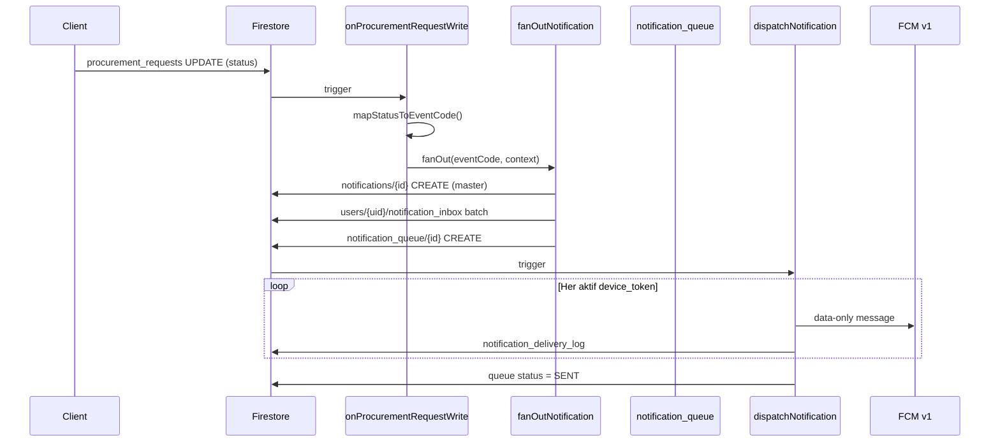

# METRİK ERP — Cloud Functions Specification

> **Sürüm:** 1.0 · 2026-07-03  
> **Runtime:** Node.js 20 · Firebase Functions v2 · TypeScript (önerilen)  
> **Durum:** Pseudo-spec — implementasyon rehberi (kod deploy edilmedi)

---

## İçindekiler

1. [Genel Bakış](#1-genel-bakış)
2. [Function Envanteri](#2-function-envanteri)
3. [Bildirim Fan-out](#3-bildirim-fan-out)
4. [SLA Timer & Escalation](#4-sla-timer--escalation)
5. [Audit & Numara Üretimi](#5-audit--numara-üretimi)
6. [Migrasyon & Dual-Write](#6-migrasyon--dual-write)
7. [Scheduled Jobs](#7-scheduled-jobs)
8. [Callable API](#8-callable-api)
9. [Hata Yönetimi & Retry](#9-hata-yönetimi--retry)
10. [Deploy & Ortam](#10-deploy--ortam)

---

## 1. Genel Bakış

```
┌─────────────────────────────────────────────────────────────────────────┐
│                         CLOUD FUNCTIONS LAYER                           │
├─────────────────────────────────────────────────────────────────────────┤
│  Firestore Triggers    │  onCreate/onUpdate procurement, orders, stock │
│  Notification Engine   │  fan-out → inbox + FCM                         │
│  SLA Scheduler         │  Pub/Sub cron → escalation notifications       │
│  Callable HTTPS        │  approve, migrate, admin ops                   │
│  Storage Triggers      │  temp cleanup, virus scan hook                 │
│  Scheduled             │  daily digest, token cleanup, archive          │
└─────────────────────────────────────────────────────────────────────────┘
         │                    │                    │
         ▼                    ▼                    ▼
    Firestore            FCM v1 API          Firebase Storage
```

**Temel prensip:** Client doğrudan `notifications` master veya başka kullanıcının `notification_inbox` yazamaz — tüm fan-out Cloud Function üzerinden.

---

## 2. Function Envanteri

| # | Function Adı | Tetikleyici | Amaç |
|---|--------------|-------------|------|
| F01 | `onProcurementRequestWrite` | Firestore onWrite `procurement_requests/{id}` | Durum değişimi → bildirim olayı |
| F02 | `onOrderWrite` | Firestore onWrite `orders/{id}` | Sipariş bildirimleri |
| F03 | `onDeliveryCreate` | Firestore onCreate `orders/{id}/deliveries/{did}` | Mal kabul bildirimi |
| F04 | `onReturnWrite` | Firestore onWrite `returns/{id}` | İade bildirimleri |
| F05 | `onStockItemUpdate` | Firestore onUpdate `stock_items/{id}` | Kritik stok uyarısı |
| F06 | `onCommentCreate` | Firestore onCreate `.../comments/{id}` | Yorum bildirimi |
| F07 | `onTaskWrite` | Firestore onWrite `tasks/{id}` | Görev atama/hatırlatma |
| F08 | `dispatchNotification` | Firestore onCreate `notification_queue/{id}` | FCM gönderimi |
| F09 | `fanOutNotification` | Internal (F01–F07 çağırır) | Inbox + queue yazma |
| F10 | `slaCheckPendingApprovals` | Pub/Sub cron `*/15 * * * *` | Onay SLA kontrolü |
| F11 | `slaCheckOverdueDeliveries` | Pub/Sub cron `0 8 * * *` | Geciken teslimat |
| F12 | `slaCheckTaskReminders` | Pub/Sub cron `*/5 * * * *` | Görev hatırlatma |
| F13 | `generateRequestNumber` | Callable | TLP-YYYY-NNN atomik |
| F14 | `generateOrderNumber` | Callable | SIP-YYYY-NNN atomik |
| F15 | `migrateLegacyTalep` | Callable (Admin) | Legacy → enterprise |
| F16 | `markNotificationRead` | Callable | Cross-device okundu sync helper |
| F17 | `cleanupTempStorage` | Pub/Sub cron `0 3 * * *` | temp/ 24h+ sil |
| F18 | `cleanupInactiveTokens` | Pub/Sub cron `0 4 * * 0` | device_tokens pasifleştir |
| F19 | `dailyDigestNotification` | Pub/Sub cron `0 18 * * 1-5` | Günlük özet (opt-in) |
| F20 | `invalidateStaleNotifications` | Pub/Sub cron `0 */1 * * *` | Gecersiz bildirim temizliği |
| F21 | `onUserRoleChange` | Firestore onUpdate `users/{uid}` | Rol değişikliği bildirimi |
| F22 | `dualWriteLegacyTalep` | Firestore onWrite (migrasyon) | Enterprise → veri/satinalma_talepler |

---

## 3. Bildirim Fan-out

### 3.1 Akış Diyagramı



### 3.2 `fanOutNotification` — Pseudo-code

```typescript
interface FanOutInput {
  eventCode: string;           // "teklif.istendi"
  entityType: string;
  entityId: string;
  parentEntityId?: string;
  metadata?: Record<string, string>;
  createdBy: string;
  createdByName: string;
  explicitTargetUids?: string[];
}

async function fanOutNotification(input: FanOutInput): Promise<string> {
  // 1. Şablon yükle
  const template = await db.doc(`notification_templates/${input.eventCode}`).get();
  if (!template.exists || !template.data()?.enabled) return;

  // 2. Hedef UID listesi oluştur
  const targetRoles: string[] = template.data().targetRoles ?? [];
  let targetUids = new Set<string>(input.explicitTargetUids ?? []);

  for (const rol of targetRoles) {
    const users = await db.collection('users')
      .where('rol', '==', rol)
      .where('aktif', '==', true)
      .get();
    users.docs.forEach(d => targetUids.add(d.id));
  }

  // 3. Oluşturan hariç tut (toast kuralı)
  targetUids.delete(input.createdBy);

  // 4. Kullanıcı bildirim ayarı filtresi
  targetUids = await filterByNotificationSettings(targetUids, template.data().category);

  // 5. Master notification
  const notificationId = uuid();
  const payload = buildPayload(input, template, notificationId);

  await db.doc(`notifications/${notificationId}`).set({
    ...payload,
    targetRoles,
    targetUids: [...targetUids],
    immutable: true,
    createdAt: FieldValue.serverTimestamp(),
  });

  // 6. Inbox batch (500/batch)
  const inboxBatch = buildInboxEntries(notificationId, payload, targetUids);
  await writeBatches(inboxBatch, (uid, entry) =>
    db.doc(`users/${uid}/notification_inbox/${notificationId}`).set(entry)
  );

  // 7. FCM kuyruğu
  await db.doc(`notification_queue/${notificationId}`).set({
    notificationId,
    status: 'PENDING',
    retryCount: 0,
    maxRetries: 3,
    scheduledAt: FieldValue.serverTimestamp(),
  });

  // 8. unreadNotificationCount denormalize (batch increment)
  await incrementUnreadCounts([...targetUids]);

  return notificationId;
}
```

### 3.3 Durum → Olay Eşlemesi (`onProcurementRequestWrite`)

| Eski status | Yeni status | eventCode |
|-------------|-------------|-----------|
| * | Hazırlanıyor (create) | `talep.olusturuldu` |
| * | İmza Sürecinde | `talep.yonetime_gonderildi` |
| İmza Sürecinde | Teklif Girişi | `teklif.istendi` |
| Karşılaştırma | Yönetim Onayında | `teklif.yonetime_gonderildi` |
| Yönetim Onayında | Karşılaştırma | `teklif.duzeltme_istendi` |
| * | Onaylandı | `talep.onaylandi` |
| * | Reddedildi | `talep.reddedildi` |
| Onaylandı | Sipariş Oluşturuldu | `siparis.olusturuldu` |

```typescript
function mapStatusTransition(before: string | null, after: string): string | null {
  if (!before) return 'talep.olusturuldu';
  const map: Record<string, string> = {
    'İmza Sürecinde|Taslak': 'talep.yonetime_gonderildi',
    'Teklif Girişi|İmza Sürecinde': 'teklif.istendi',
    'Yönetim Onayında|Karşılaştırma': 'teklif.yonetime_gonderildi',
    'Karşılaştırma|Yönetim Onayında': 'teklif.duzeltme_istendi',
    'Onaylandı|Yönetim Onayında': 'talep.onaylandi',
    'Reddedildi|*': 'talep.reddedildi',
    'Sipariş Oluşturuldu|Onaylandı': 'siparis.olusturuldu',
  };
  // ... lookup logic
}
```

### 3.4 `dispatchNotification` — FCM Pseudo-code

```typescript
async function dispatchNotification(queueId: string, queue: QueueDoc) {
  const notification = await db.doc(`notifications/${queue.notificationId}`).get();
  const data = buildFcmDataPayload(notification.data());

  const tokens = await collectActiveTokens(notification.data().targetUids);

  for (const { uid, token, platform, rol } of tokens) {
    try {
      // Rol bazlı route (mevcut BildirimRotaServisi mantığı)
      const routeData = { ...data, route: resolveRoute(notification.data(), rol) };

      await admin.messaging().send({
        token,
        data: stringifyData(routeData),
        android: { priority: mapPriority(notification.data().priority) },
        apns: { headers: { 'apns-priority': '10' } },
      });

      await logDelivery(queue.notificationId, uid, token, 'SENT');
    } catch (err) {
      if (isInvalidToken(err)) await deactivateToken(token);
      await logDelivery(queue.notificationId, uid, token, 'FAILED', err);
    }
  }

  await db.doc(`notification_queue/${queueId}`).update({
    status: 'SENT',
    processedAt: FieldValue.serverTimestamp(),
  });
}
```

### 3.5 FCM Data Payload (Function çıktısı)

```json
{
  "v": "1",
  "notificationId": "uuid",
  "eventCode": "siparis.olusturuldu",
  "type": "INFO",
  "priority": "HIGH",
  "title": "Sipariş Oluşturuldu",
  "message": "SIP-2026-045 — XYZ Elektrik",
  "module": "satinalma",
  "screen": "siparis-detay",
  "entityType": "siparis",
  "entityId": "uuid",
  "parentEntityId": "talep-uuid",
  "action": "view",
  "deepLink": "metrik://satinalma/siparis-detay?entityId=uuid",
  "route": "onaylanan-malzemeler",
  "silent": "false"
}
```

---

## 4. SLA Timer & Escalation

### 4.1 SLA Tanımları

| SLA Kodu | Koşul | Süre | Escalation eventCode | Hedef |
|----------|-------|------|----------------------|-------|
| SLA-APPROVAL-WARN | status = Yönetim Onayında | 24 saat | `talep.sla_yaklasiyor` | Yönetim |
| SLA-APPROVAL-CRIT | status = Yönetim Onayında | 48 saat | `talep.sla_asildi` | Yönetim, Satınalma, Admin |
| SLA-ACIL-APPROVAL | requestType = Acil + Yönetim Onayında | 4 saat | `talep.acil_onay_bekliyor` | Yönetim, Admin |
| SLA-QUOTE | status = Teklif Girişi + 0 teklif | 72 saat | `teklif.suresi_doluyor` | Satınalma |
| SLA-DELIVERY | order.status = SEVKIYATTA + deliveryDate geçti | 1 gün | `depo.teslimat_gecikti` | Satınalma, Depo |
| SLA-TASK | task.dueDate yaklaşıyor | 24 saat önce | `gorev.hatirlatma` | Atanan UID |

### 4.2 `slaCheckPendingApprovals` — Pseudo-code

```typescript
// Cron: */15 * * * * (her 15 dakika)
export const slaCheckPendingApprovals = onSchedule('*/15 * * * *', async () => {
  const now = Date.now();
  const warnThreshold = now - 24 * 60 * 60 * 1000;
  const critThreshold = now - 48 * 60 * 60 * 1000;
  const acilThreshold = now - 4 * 60 * 60 * 1000;

  // Yönetim Onayında talepler
  const pending = await db.collection('procurement_requests')
    .where('status', '==', 'Yönetim Onayında')
    .get();

  for (const doc of pending.docs) {
    const data = doc.data();
    const updatedAt = data.updatedAtUtc ?? 0;
    const isAcil = data.requestType === 'Acil';

    // Idempotency: aynı SLA bildirimi tekrar gönderilmesin
    const slaKey = `sla:${doc.id}:${isAcil ? 'acil' : 'approval'}`;
    if (await alreadySent(slaKey)) continue;

    if (isAcil && updatedAt < acilThreshold) {
      await fanOutNotification({
        eventCode: 'talep.acil_onay_bekliyor',
        entityType: 'talep',
        entityId: doc.id,
        metadata: { talepNo: data.requestNo },
        createdBy: 'system',
        createdByName: 'Sistem',
      });
      await markSlaSent(slaKey);
    } else if (updatedAt < critThreshold) {
      await fanOutNotification({ eventCode: 'talep.sla_asildi', ... });
      await markSlaSent(slaKey);
    } else if (updatedAt < warnThreshold) {
      await fanOutNotification({ eventCode: 'talep.sla_yaklasiyor', ... });
      await markSlaSent(slaKey);
    }
  }
});
```

### 4.3 SLA Idempotency Store

```
system_config/sla_sent/{slaKey} → { sentAt, notificationId }
TTL: 7 gün (Firestore TTL policy veya scheduled cleanup)
```

### 4.4 Escalation Zinciri (SAP Release Strategy benzeri)

```
T+0   → Normal bildirim (teklif.yonetime_gonderildi)
T+24h → SLA uyarı (talep.sla_yaklasiyor) → Yönetim
T+48h → SLA aşım (talep.sla_asildi) → Yönetim + Satınalma + Admin
T+72h → Admin escalation e-posta (optional Cloud Function → SendGrid)
```

---

## 5. Audit & Numara Üretimi

### 5.1 `generateRequestNumber` — Callable

```typescript
export const generateRequestNumber = onCall(async (request) => {
  requireAuth(request);
  requireRole(request, ['Admin', 'Satınalma', 'Şef', 'Saha', 'Atölye']);

  return await db.runTransaction(async (tx) => {
    const settingsRef = db.doc('procurement_settings/default');
    const settings = (await tx.get(settingsRef)).data();
    const year = new Date().getFullYear();
    const seq = (settings?.lastRequestSequence ?? 0) + 1;
    tx.update(settingsRef, { lastRequestSequence: seq });
    return `TLP-${year}-${String(seq).padStart(3, '0')}`;
  });
});
```

### 5.2 Audit Trail (otomatik)

Her `onWrite` trigger'da değişen alanlar:

```typescript
async function writeAuditTrail(
  collection: string,
  docId: string,
  before: DocumentData | null,
  after: DocumentData,
  authUid: string
) {
  const changes = diffFields(before, after);
  if (changes.length === 0) return;

  await db.collection(`${collection}/${docId}/audit_trail`).add({
    action: before ? 'UPDATE' : 'CREATE',
    userUid: authUid,
    userName: await getUserName(authUid),
    timestamp: FieldValue.serverTimestamp(),
    changes,  // [{ field, oldValue, newValue }]
  });
}
```

---

## 6. Migrasyon & Dual-Write

### 6.1 `dualWriteLegacyTalep` (Geçiş dönemi)

```typescript
// Enterprise procurement_requests onWrite → veri/satinalma_talepler JSON güncelle
export const dualWriteLegacyTalep = onDocumentWritten(
  'procurement_requests/{id}',
  async (event) => {
    if (!MIGRATION_DUAL_WRITE_ENABLED) return;

    const after = event.data?.after?.data();
    if (!after) return;

    const legacyTalep = mapEnterpriseToLegacySatinalmaTalep(after);
    await mergeIntoLegacyJsonBlob('veri/satinalma_talepler', legacyTalep);
  }
);
```

### 6.2 `migrateLegacyTalep` — Callable (Admin batch)

```typescript
export const migrateLegacyTalep = onCall(async (request) => {
  requireAdmin(request);
  const { batchSize = 50, dryRun = false } = request.data;

  const legacyJson = await readLegacyBlob('veri/satinalma_talepler');
  const talepler: LegacyTalep[] = JSON.parse(legacyJson);
  const unmigrated = talepler.filter(t => !t._migrated);

  let count = 0;
  for (const talep of unmigrated.slice(0, batchSize)) {
    if (!dryRun) {
      await writeEnterpriseFromLegacy(talep);
      talep._migrated = true;
    }
    count++;
  }

  if (!dryRun) await writeLegacyBlob('veri/satinalma_talepler', talepler);
  return { migrated: count, remaining: unmigrated.length - count };
});
```

---

## 7. Scheduled Jobs

| Function | Cron | Açıklama |
|----------|------|----------|
| `slaCheckPendingApprovals` | `*/15 * * * *` | Onay SLA |
| `slaCheckOverdueDeliveries` | `0 8 * * *` | Geciken teslimat (08:00) |
| `slaCheckTaskReminders` | `*/5 * * * *` | Görev hatırlatma |
| `cleanupTempStorage` | `0 3 * * *` | temp/ temizlik |
| `cleanupInactiveTokens` | `0 4 * * 0` | 30 gün inactive token |
| `invalidateStaleNotifications` | `0 */1 * * *` | Gecersiz bildirim arşivle |
| `dailyDigestNotification` | `0 18 * * 1-5` | Hafta içi 18:00 özet |

### 7.1 `cleanupTempStorage`

```typescript
export const cleanupTempStorage = onSchedule('0 3 * * *', async () => {
  const bucket = admin.storage().bucket();
  const [files] = await bucket.getFiles({ prefix: 'temp/' });
  const cutoff = Date.now() - 24 * 60 * 60 * 1000;

  for (const file of files) {
    const [metadata] = await file.getMetadata();
    const created = new Date(metadata.timeCreated).getTime();
    if (created < cutoff) await file.delete();
  }
});
```

### 7.2 `invalidateStaleNotifications`

Mevcut `BildirimFiltreleme.GecerliMi()` mantığının server-side karşılığı:

```typescript
// Her saat: inbox'taki bildirimleri talep durumuyla karşılaştır
// Geçersiz olanları localState = 'INVALIDATED' yap (silme yok)
```

---

## 8. Callable API

| Endpoint | Rol | Input | Output |
|----------|-----|-------|--------|
| `generateRequestNumber` | Talep oluşturan | — | `{ requestNo }` |
| `generateOrderNumber` | Satınalma | — | `{ orderNo }` |
| `migrateLegacyTalep` | Admin | `{ batchSize, dryRun }` | `{ migrated, remaining }` |
| `markNotificationRead` | Auth | `{ notificationId }` | `{ success }` |
| `sendSystemAnnouncement` | Admin | `{ title, body, targetRoles }` | `{ announcementId }` |
| `recalculateSupplierScore` | Admin/Satınalma | `{ supplierId }` | `{ score }` |

---

## 9. Hata Yönetimi & Retry

### 9.1 notification_queue Retry

```
PENDING → PROCESSING → SENT
                    ↘ FAILED (retryCount++)
                       ↘ retryCount >= maxRetries → DEAD_LETTER
```

| retryCount | Bekleme |
|------------|---------|
| 1 | 30 saniye |
| 2 | 2 dakika |
| 3 | 10 dakika |
| ≥ maxRetries | DEAD_LETTER + Admin alert |

### 9.2 Idempotency

- `notificationId` UUID — duplicate fan-out önleme
- SLA keys — `system_config/sla_sent/{key}`
- Transaction — numara üretimi

### 9.3 Dead Letter Monitoring

```
DEAD_LETTER queue → Cloud Monitoring alert → Admin bildirim (sistem.hata)
```

---

## 10. Deploy & Ortam

### 10.1 Proje Yapısı

```
functions/
├── src/
│   ├── index.ts
│   ├── triggers/
│   │   ├── procurement.ts
│   │   ├── orders.ts
│   │   ├── stock.ts
│   │   └── notifications.ts
│   ├── scheduled/
│   │   ├── sla.ts
│   │   └── cleanup.ts
│   ├── callable/
│   │   ├── numbers.ts
│   │   └── migration.ts
│   └── lib/
│       ├── fanOut.ts
│       ├── fcm.ts
│       ├── rbac.ts
│       └── legacy-mapper.ts
├── package.json
└── tsconfig.json
```

### 10.2 Ortam Değişkenleri

| Değişken | Açıklama |
|----------|----------|
| `MIGRATION_DUAL_WRITE_ENABLED` | true/false |
| `FCM_DRY_RUN` | Test modunda FCM gönderme |
| `SLA_ACIL_HOURS` | 4 (default) |
| `SLA_APPROVAL_WARN_HOURS` | 24 |
| `SLA_APPROVAL_CRIT_HOURS` | 48 |

### 10.3 Deploy

```bash
cd functions && npm install
firebase deploy --only functions
firebase deploy --only functions:onProcurementRequestWrite,functions:dispatchNotification
```

### 10.4 Maliyet Tahmini (10K kullanıcı, 1M bildirim/gün)

| Kaynak | Tahmin |
|--------|--------|
| Firestore writes (fan-out) | ~3M write/gün (inbox batch) |
| Cloud Functions invocations | ~1.5M/gün |
| FCM | 1M message/gün (ücretsiz kotanın üstünde olabilir) |
| **Optimizasyon** | Batch inbox write, digest mode, silent sync |

---

*İlgili: [BILDIRIM_NAVIGASYON_MIMARISI.md](./BILDIRIM_NAVIGASYON_MIMARISI.md) · [FIRESTORE_DATABASE_DESIGN.md](./FIRESTORE_DATABASE_DESIGN.md)*
