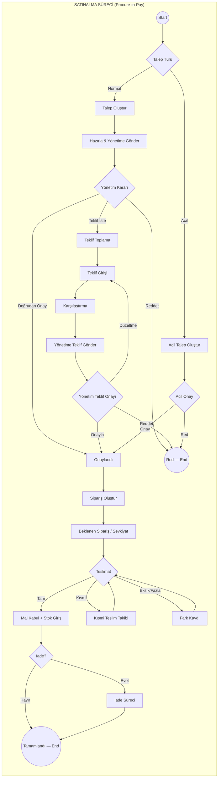
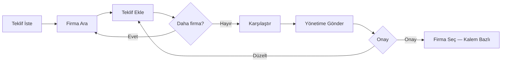
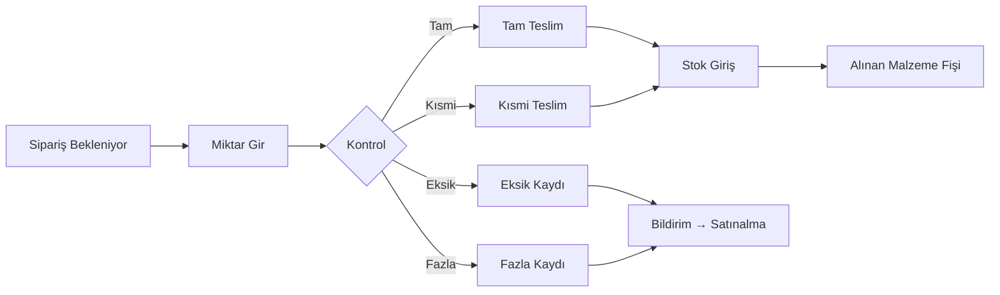
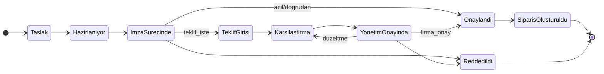
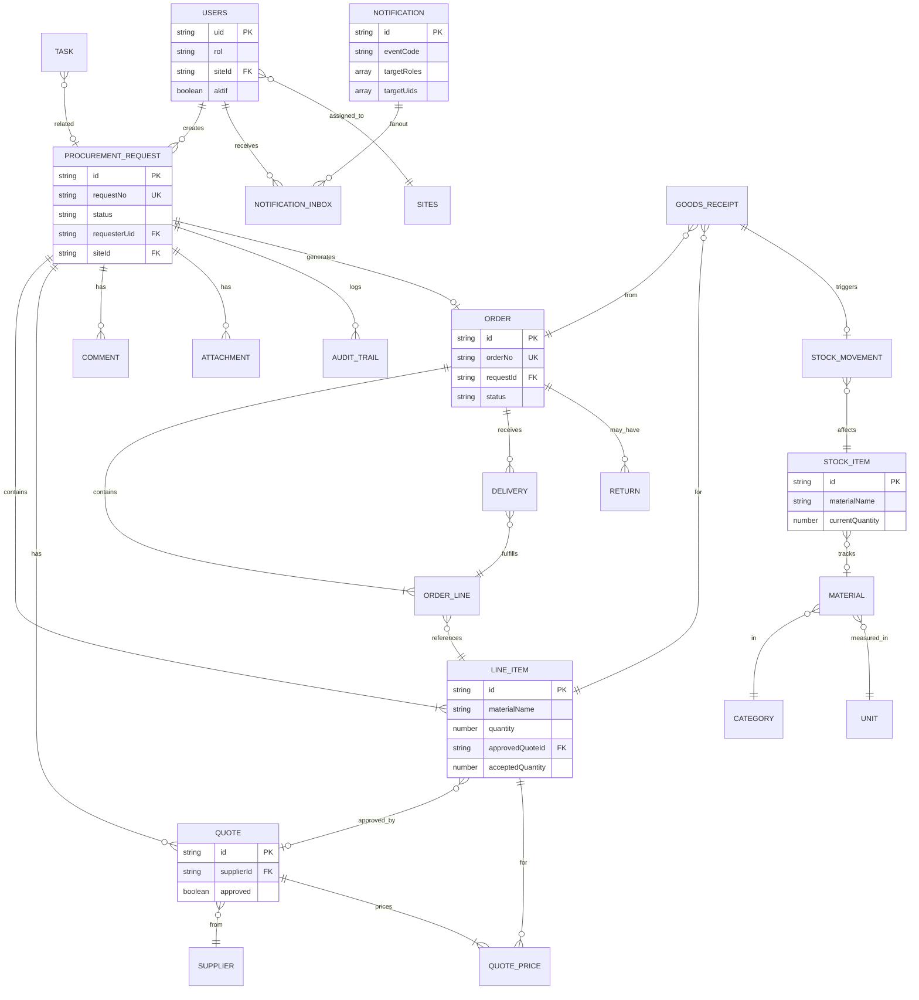
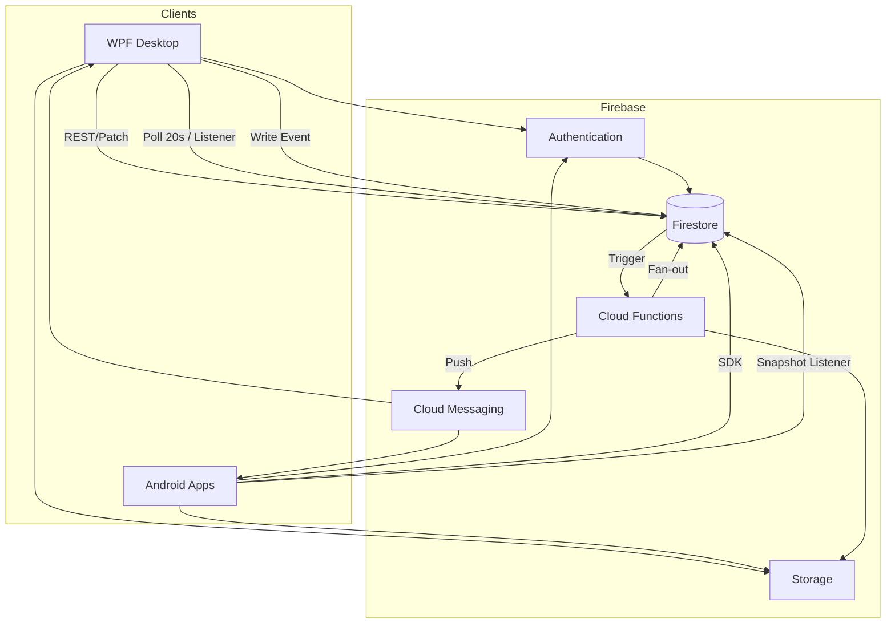
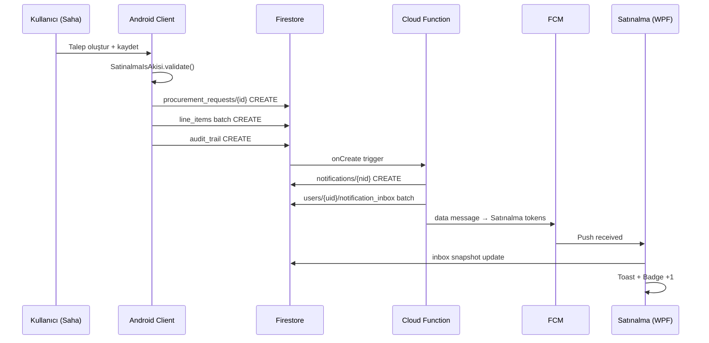

# METRİK ERP — Complete Workflow Documentation

> **Sürüm:** 2.0 Enterprise · 2026-07-03  
> **Kapsam:** BPMN 2.0 · RBAC · State Machine · ERD · Notification Matrix · Navigation Matrix · API/Data Flow

---

## İçindekiler

1. [Sistem Bağlamı](#1-sistem-bağlamı)
2. [BPMN 2.0 İş Akışları](#2-bpmn-20-iş-akışları)
3. [RBAC — Rol Yetki Matrisi](#3-rbac--rol-yetki-matrisi)
4. [State Machine — Durum Geçiş Matrisi](#4-state-machine--durum-geçiş-matrisi)
5. [ERD — Varlık İlişki Diyagramı](#5-erd--varlık-i̇lişki-diyagramı)
6. [Notification Matrix](#6-notification-matrix)
7. [Navigation Matrix](#7-navigation-matrix)
8. [API & Data Flow](#8-api--data-flow)

---

## 1. Sistem Bağlamı

### 1.1 Platform Mimarisi

```
┌──────────────┐     ┌──────────────┐     ┌─────────────────────────────┐
│ Android Apps │     │  WPF Desktop │     │     Firebase Cloud          │
│ Kotlin/Compose│     │  C#/MVVM     │     │ Auth · Firestore · FCM ·   │
│ Saha·Sat·Depo│     │  ERP Merkezi │     │ Storage · Cloud Functions   │
└──────┬───────┘     └──────┬───────┘     └──────────────┬──────────────┘
       │                    │                            │
       └────────────────────┴────────────────────────────┘
                    SatinalmaPro.Shared
              (Modeller · İş Kuralları · Bildirim)
```

### 1.2 Modül Envanteri

| Modül | Android | WPF | Firestore |
|-------|---------|-----|-----------|
| Satınalma Merkezi | ✓ Satınalma | ✓ SatinalmaMerkeziView | procurement_requests |
| Talep Yönetimi | ✓ Saha/Şef | ✓ SatinalmaView | procurement_requests |
| Teklif & Onay | ✓ Satınalma/Yönetim | ✓ | quotes subcollection |
| Sipariş & Depo | ✓ Depo/Satınalma | ✓ | orders, deliveries |
| Stok | ✓ Depo/Atölye | ✓ StokYonetimiView | stock_items |
| Admin | ✓ Admin | ✓ AyarlarView | users, master data |
| Bildirim | ✓ Tüm roller | ✓ BildirimlerWindow | notification_inbox |

---

## 2. BPMN 2.0 İş Akışları

### 2.1 Ana Süreç — Satınalma (Procure-to-Pay)



### 2.2 BPMN Havuzlar (Swimlanes)

| Havuz | Rol | BPMN Görevleri |
|-------|-----|----------------|
| **Talep** | Şef, Saha, Atölye, Satınalma | User Task: Talep oluştur, düzenle |
| **Yönetim** | Yönetim, Admin | User Task: Onay, red, teklif iste |
| **Satınalma** | Satınalma, Admin | User Task: Teklif, karşılaştır, sipariş |
| **Depo** | Depo, Admin | User Task: Mal kabul, stok giriş |
| **Sistem** | Cloud Function | Service Task: Bildirim, audit, numara |

### 2.3 Alt Süreç — Teklif Yönetimi



### 2.4 Alt Süreç — Depo Mal Kabul



### 2.5 BPMN Olay Tanımları

| Olay Tipi | Kod | Tetikleyici |
|-----------|-----|-------------|
| Message Start | `MSG_TALEP_OLUSTUR` | Kullanıcı talep kaydeder |
| Timer Intermediate | `TMR_SLA_24H` | 24 saat onay bekleyen |
| Message Catch | `MSG_TEKLIF_GELDI` | Teklif eklendi |
| Signal Throw | `SIG_SIPARIS_VERILDI` | Sipariş oluşturuldu |
| Error End | `ERR_REDDEDILDI` | Yönetim red |
| Terminate End | `END_TAMAMLANDI` | Tam teslim + stok |

---

## 3. RBAC — Rol Yetki Matrisi

### 3.1 Rol Tanımları

Kaynak: `KullaniciRolleri.cs`, `KullaniciYetkileri.cs`, `RolNavigasyonu.cs`

| Rol | Kod | ERP Karşılığı |
|-----|-----|---------------|
| Admin | Admin | SAP Super User |
| Yönetim | Yönetim | SAP Release Strategy Approver |
| Satınalma | Satınalma | SAP MM Purchaser |
| Depo | Depo | SAP WM Warehouse Clerk |
| Şef | Şef | SAP Requester (Site Manager) |
| Saha | Saha | SAP Requester (Field) |
| Atölye | Atölye | SAP Requester (Read-only stock) |

### 3.2 İşlem × Rol Matrisi (Satınalma)

| İşlem | Admin | Yönetim | Satınalma | Depo | Şef | Saha | Atölye |
|-------|:-----:|:-------:|:---------:|:----:|:---:|:----:|:------:|
| Talep oluştur | ✓ | ✓ | ✓ | — | ✓ | ✓ | ✓ |
| Tüm talepleri gör | ✓ | ✓ | ✓ | — | ✓ | ✓ | ✓ |
| Kendi talebini düzenle/sil (onay öncesi) | ✓ | — | ✓ | — | ✓* | ✓* | ✓* |
| Tüm talepleri düzenle/sil | ✓ | — | ✓ | — | — | — | — |
| Teklif görüntüle | ✓ | ✓ | ✓ | — | — | — | — |
| Teklif ekle/düzenle/sil | ✓ | — | ✓ | — | — | — | — |
| Teklif yönetime gönder | ✓ | — | ✓ | — | — | — | — |
| Acil onay/red | ✓ | ✓ | — | — | — | — | — |
| Teklif iste / doğrudan onay / red | ✓ | ✓ | — | — | — | — | — |
| Teklif karşılaştır / firma seç | ✓ | ✓ | ✓ | — | — | — | — |
| Sipariş oluştur/düzenle | ✓ | — | ✓ | — | — | — | — |
| Beklenen sipariş takip | ✓ | ✓ | ✓ | ✓ | — | — | — |
| Mal kabul (kısmi/tam) | ✓ | — | ✓ | ✓ | — | — | — |
| İade yönetimi | ✓ | — | ✓ | ✓ | — | — | — |
| Stok görüntüle | ✓ | ✓ | ✓ | ✓ | ✓ | ✓ | ✓ |
| Stok giriş/çıkış/sayım | ✓ | — | ✓ | ✓ | — | — | — |
| Tedarikçi yönetimi | ✓ | — | ✓ | — | — | — | — |
| Kullanıcı/rol/şantiye yönetimi | ✓ | — | — | — | — | — | — |

\* `requesterUid` eşleşmesi + durum `Taslak`/`Hazırlanıyor`

### 3.3 Modül Erişim Matrisi

| Modül | Admin | Yönetim | Satınalma | Şef | Saha | Atölye | Depo |
|-------|:-----:|:-------:|:---------:|:---:|:----:|:------:|:----:|
| Satınalma Merkezi | ✓ | ✓ | ✓ | ✓ | ✓ | ✓ | — |
| Stok Yönetimi | ✓ | R | ✓ | R | R | R | ✓ |
| Alınan Malzemeler | ✓ | — | ✓ | R | — | — | — |
| Agrega / Çimento | ✓ | — | ✓ | R | — | — | — |
| Ayarlar / Admin | ✓ | — | — | — | — | — | — |

R = Salt okunur

### 3.4 Sekme Görünürlük Matrisi (Satınalma Modülü)

| Sekme | Admin | Yönetim | Satınalma | Şef | Saha | Atölye | Depo |
|-------|:-----:|:-------:|:---------:|:---:|:----:|:------:|:----:|
| Taleplerim | ✓ | — | ✓ | ✓ | ✓ | — | — |
| Gelen Talepler | ✓ | ✓ | ✓ | — | — | — | — |
| Teklif Girişi | ✓ | — | ✓ | — | — | — | — |
| Karşılaştırma | ✓ | — | ✓ | — | — | — | — |
| Teklif Onay | ✓ | ✓ | ✓ | — | — | — | — |
| Siparişler | ✓ | — | ✓ | — | — | — | — |
| Beklenen Siparişler | ✓ | ✓ | ✓ | — | — | — | ✓ |
| Teslimatlar | ✓ | — | ✓ | — | — | — | ✓ |
| İadeler | ✓ | — | ✓ | — | — | — | — |
| Görevler | ✓ | — | ✓ | — | — | — | — |

---

## 4. State Machine — Durum Geçiş Matrisi

### 4.1 Talep Durumları (`SatinalmaTalepDurumlari`)

| Durum | Skor | Terminal |
|-------|------|----------|
| Taslak | 0 | — |
| Hazırlanıyor | 20 | — |
| İmza Sürecinde | 30 | — |
| Teklif Girişi | 40 | — |
| Karşılaştırma | 50 | — |
| Yönetim Onayında | 60 | — |
| Onaylandı | 70 | — |
| Reddedildi | 15 | ✓ |
| Sipariş Oluşturuldu | 90 | ✓* |

### 4.2 Talep Geçiş Matrisi

| Kaynak → Hedef | Olay | Rol | Koşul |
|----------------|------|-----|-------|
| Taslak → Hazırlanıyor | Kaydet | Oluşturan | Kalemler dolu |
| Hazırlanıyor → İmza Sürecinde | Yönetime gönder | Oluşturan/Satınalma | Teklif yok |
| İmza Sürecinde → Teklif Girişi | Teklif İste | Yönetim | Normal talep |
| İmza Sürecinde → Onaylandı | Doğrudan/Acil Onay | Yönetim | Acil veya teklifsiz |
| Teklif Girişi → Karşılaştırma | Teklif eklendi | Satınalma | ≥1 teklif |
| Karşılaştırma → Yönetim Onayında | Teklif gönder | Satınalma | Teklifler tamam |
| Yönetim Onayında → Karşılaştırma | Düzeltme iste | Yönetim/Satınalma | Revizyon |
| Yönetim Onayında → Onaylandı | Firma onayla | Yönetim | Kalem bazlı |
| * → Reddedildi | Reddet | Yönetim | — |
| Onaylandı → Sipariş Oluşturuldu | Sipariş ver | Satınalma | Onay kilitli |
| Onaylandı → Karşılaştırma | Onay geri al | Satınalma | Sipariş öncesi |



### 4.3 Sipariş Durumları (Enterprise)

| Durum | Kod | Geçişler |
|-------|-----|----------|
| Hazırlanıyor | HAZIRLANIYOR | → VERILDI |
| Verildi | VERILDI | → SEVKIYATTA |
| Sevkiyatta | SEVKIYATTA | → KISMI_TESLIM, TAM_TESLIM |
| Kısmi Teslim | KISMI_TESLIM | → TAM_TESLIM, IADE |
| Tam Teslim | TAM_TESLIM | Terminal |
| İade | IADE | → (iade süreci) |
| İptal | IPTAL | Terminal |

### 4.4 Kalem Teslimat State (Türetilmiş)

| Durum | Koşul |
|-------|-------|
| Bekliyor | `acceptedQuantity = 0` |
| Kısmi | `0 < acceptedQuantity < quantity` |
| Tamamlandı | `acceptedQuantity >= quantity` |

### 4.5 İade Durumları

`BEKLIYOR` → `SURECTE` → `TAMAMLANDI`

---

## 5. ERD — Varlık İlişki Diyagramı

### 5.1 Enterprise ERD



### 5.2 Legacy → Enterprise Eşleme

| Legacy (JSON blob) | Enterprise |
|--------------------|------------|
| `SatinalmaTalep` | `procurement_requests` |
| `SatinalmaTalepKalemi` | `line_items` |
| `SatinalmaTeklif` | `quotes` + `quote_prices` |
| `durum=Sipariş Oluşturuldu` | `orders` |
| `kabulEdilenMiktar` | `line_items.acceptedQuantity` |
| `AlinanMalzemeKaydi` | `goods_receipts` |
| `StokKaydi` | `stock_items` |
| `BildirimKaydi` | `notifications` + `notification_inbox` |

---

## 6. Notification Matrix

### 6.1 Olay → Rol → Navigasyon (Özet)

| Olay Kodu | Hedef Roller | Priority | Deep Link Screen |
|-----------|--------------|----------|------------------|
| `talep.olusturuldu` | Yönetim, Satınalma, Admin | MEDIUM | `gelen-talepler` |
| `talep.yonetime_gonderildi` | Yönetim, Satınalma, Admin | HIGH | `gelen-talepler` |
| `teklif.istendi` | Satınalma, Admin | HIGH | `teklif-giris` |
| `teklif.yonetime_gonderildi` | Yönetim, Admin | HIGH | `teklif-onay` |
| `teklif.firma_secildi` | Satınalma, Admin | MEDIUM | `teklif-karsilastirma` |
| `talep.onaylandi` | Satınalma, TS, Admin | MEDIUM | `onaylanan-talepler` |
| `talep.reddedildi` | TS, Admin | HIGH | `talep-detay` / `red-talepler` |
| `siparis.olusturuldu` | Depo, Satınalma, TS, Admin | HIGH | `siparis-detay` |
| `depo.mal_kabul_yapildi` | Satınalma, TS, Admin | MEDIUM | `mal-kabul` |
| `depo.kismi_teslim` | Satınalma, TS, Yönetim, Admin | HIGH | `mal-kabul` |
| `depo.eksik_teslim` | Satınalma, TS, Admin | HIGH | `mal-kabul` |
| `stok.kritik_seviye` | Satınalma, Depo, Admin | CRITICAL | `stok-durum` |
| `iade.olusturuldu` | Satınalma, Depo, TS, Admin | HIGH | `iade-detay` |
| `gorev.atandi` | Atanan UID, Admin | HIGH | `gorev-detay` |
| `sistem.duyuru` | Tüm aktif | MEDIUM | `duyuru-detay` |

Tam liste: [BILDIRIM_NAVIGASYON_MIMARISI.md §2](./BILDIRIM_NAVIGASYON_MIMARISI.md)

### 6.2 Mevcut → Hedef Bildirim Tipi Eşlemesi

| Legacy `BildirimTipleri` | Enterprise `eventCode` |
|--------------------------|------------------------|
| `yonetime_gonderildi` | `talep.yonetime_gonderildi` |
| `teklif_istendi` | `teklif.istendi` |
| `teklif_onayda` | `teklif.yonetime_gonderildi` |
| `teklif_duzeltme_istendi` | `teklif.duzeltme_istendi` |
| `onaylandi` | `talep.onaylandi` |
| `reddedildi` | `talep.reddedildi` |
| `siparis_olusturuldu` | `siparis.olusturuldu` |
| `mal_kabul_edildi` | `depo.mal_kabul_yapildi` |

---

## 7. Navigation Matrix

### 7.1 Deep Link URI Şeması

```
metrik://{module}/{screen}?entityType={type}&entityId={id}&parentId={pid}&tab={tab}&action={action}&bid={notificationId}
```

### 7.2 Bildirim → Navigasyon Tam Matrisi

| eventCode | module | screen | tab | entityType | action | Android Route | WPF Module/Sekme |
|-----------|--------|--------|-----|------------|--------|---------------|------------------|
| `talep.olusturuldu` | satinalma | talep-detay | talepler | talep | view | `talep-detay?id=` | Satınalma / Taleplerim |
| `talep.yonetime_gonderildi` | satinalma | gelen-talepler | — | talep | review | `gelen-talepler` | Satınalma / Gelen Talepler |
| `teklif.istendi` | satinalma | teklif-giris | teklifler | talep | add_quote | `teklif-gir` | Satınalma / Teklif Girişi |
| `teklif.yonetime_gonderildi` | satinalma | teklif-onay-detay | teklif-onay | talep | compare | `teklif-onay-detay?id=` | Satınalma / Teklif Onay |
| `teklif.duzeltme_istendi` | satinalma | teklif-giris | teklifler | talep | edit_quote | `teklif-gir` | Satınalma / Teklif Girişi |
| `talep.onaylandi` | satinalma | onaylanan-talepler | — | talep | view | `onaylanan-talepler` | Satınalma / Onaylanan |
| `talep.reddedildi` | satinalma | talep-detay | — | talep | view | `talep-detay?id=` | Satınalma / Red Talepler |
| `siparis.olusturuldu` | satinalma | siparis-detay | siparisler | siparis | view | `onaylanan-malzemeler` | Satınalma / Alınan Malzemeler |
| `depo.mal_kabul_yapildi` | depo | mal-kabul | teslimatlar | siparis | receive | `onaylanan-malzemeler` | Satınalma / Alınan Malzemeler |
| `depo.kismi_teslim` | satinalma | mal-kabul | teslimatlar | kalem | investigate | `onaylanan-malzemeler` | Satınalma / Teslimatlar |
| `stok.kritik_seviye` | stok | stok-durum | — | stok | view | `stok-durum` | Stok / Stok Durumu |
| `iade.olusturuldu` | satinalma | iade-detay | iadeler | iade | manage | `iade-detay?id=` | Satınalma / İadeler |
| `gorev.atandi` | satinalma | gorev-detay | gorevler | gorev | complete | `gorev-detay?id=` | Satınalma / Görevler |

Kaynak (mevcut): `BildirimRotaServisi.cs`

### 7.3 Navigation Router Akışı

```
Push/Inbox Tap
    → Parse deepLink URI
    → Auth check (logged in?)
    → RBAC guard (role can access screen?)
    → Entity fetch (Firestore — entity still exists?)
    → Module switch (MainWindow / NavController)
    → Screen navigate
    → Tab select
    → Entity highlight (DataGrid row / detail panel)
    → Action mode (approve form, receive form…)
    → Mark notification: isRead=true, actedAt=now
```

---

## 8. API & Data Flow

### 8.1 Veri Akış Mimarisi



### 8.2 API Katmanları

| Katman | Teknoloji | Sorumluluk |
|--------|-----------|------------|
| **Client Repository** | C# / Kotlin | Firestore CRUD, cache, offline |
| **Shared Domain** | SatinalmaPro.Shared | İş kuralları, validasyon |
| **Firestore REST** | WPF `FirestoreVeriServisi` | HTTP PATCH/GET |
| **Firestore SDK** | Android Firebase SDK | Real-time listener |
| **Cloud Functions** | Node.js | Bildirim fan-out, migrasyon, SLA |
| **FCM** | `FcmPushServisi` | Push dispatch |

### 8.3 Talep Oluşturma — Sequence Diagram



### 8.4 Teklif Onay — Data Flow

```
1. Satınalma → quotes/{id} WRITE
2. Satınalma → procurement_requests.status = "Karşılaştırma"
3. Satınalma → procurement_requests.status = "Yönetim Onayında"
4. Cloud Function → notification (teklif.yonetime_gonderildi)
5. Yönetim Android → teklif-onay-detay?id={requestId}
6. Yönetim → line_items.approvedQuoteId SET (kalem bazlı)
7. procurement_requests.status = "Onaylandı"
8. Cloud Function → notification (talep.onaylandi) → Satınalma + TS
```

### 8.5 Mal Kabul — Data Flow

```
1. Depo → deliveries/{id} CREATE (miktar, durum)
2. Depo → line_items.acceptedQuantity INCREMENT
3. Depo → goods_receipts/{id} CREATE
4. Depo → stock_movements/{id} CREATE (Giriş)
5. Depo → stock_items.currentQuantity INCREMENT
6. Cloud Function → notification (depo.mal_kabul_yapildi / kismi / eksik)
7. Satınalma WPF → inbox → mal-kabul deep link
```

### 8.6 Senkronizasyon Protokolü

| Veri | Yön | Mekanizma | Çakışma |
|------|-----|-----------|---------|
| Talepler | Bi-directional | `guncellemeUtc` / `version` | Yüksek skor kazanır |
| Stok | Bi-directional | `updatedAt` | Last-write-wins |
| Bildirim inbox | Server → Client | Snapshot listener | isRead merge (OR) |
| Ayarlar | Bi-directional | `updatedAt` | Admin override |
| Legacy `veri/*` | Bi-directional | JSON blob `updatedAt` | Mevcut mantık |

Kaynak: `BulutVeriSenkronu.cs`, `SatinalmaTalepDurumlari.SurecAsamaSkoru()`

### 8.7 Client API Sözleşmesi (Shared Operations)

| Operasyon | Shared Helper | Firestore Path |
|-----------|---------------|----------------|
| Talep oluştur | `SatinalmaMobilServisi.TalepOlustur` | procurement_requests |
| Yönetime gönder | `SatinalmaYonetimGonderimi` | status update |
| Teklif ekle | `SatinalmaIsAkisi.TeklifEklenebilir` | quotes subcollection |
| Firma onayla | `SatinalmaSiparisIslemleri` | line_items.approvedQuoteId |
| Sipariş ver | `SatinalmaSiparisIslemleri.SiparisVer` | orders + status |
| Mal kabul | `SatinalmaSiparisIslemleri.MalKabul` | deliveries + stock |
| Bildirim gönder | `SatinalmaBildirimleri.*Async` | notifications (→ CF) |
| Navigasyon | `BildirimRotaServisi.HedefRoute` | — |

### 8.8 Offline Data Flow

```
┌─────────────┐     ┌──────────────┐     ┌─────────────┐
│ Offline     │────▶│ Local Queue  │────▶│ Reconnect   │
│ Action      │     │ (SQLite/JSON)│     │ Batch Sync  │
└─────────────┘     └──────────────┘     └──────┬──────┘
                                                 │
                    ┌────────────────────────────▼──────┐
                    │ Firestore Merge + Conflict Resolve │
                    │ Inbox Pull (missed notifications)  │
                    └─────────────────────────────────────┘
```

| Offline Aksiyon | Davranış |
|-----------------|----------|
| Talep oluştur | Local queue → sync on reconnect |
| Push alma | FCM queue (Android); inbox pull (WPF açılış) |
| Okundu işareti | Local optimistic → merge on reconnect |
| Stok hareket | Local queue + conflict warning |

---

## Ek: Doküman İndeksi

| Doküman | İçerik |
|---------|--------|
| [CLOUD_FUNCTIONS_SPEC.md](./CLOUD_FUNCTIONS_SPEC.md) | Fan-out, SLA, scheduled jobs, callable API |
| [STORAGE_SECURITY_RULES.md](./STORAGE_SECURITY_RULES.md) | Storage Rules dokümantasyonu |
| [FIRESTORE_DATABASE_DESIGN.md](./FIRESTORE_DATABASE_DESIGN.md) | Tüm koleksiyonlar, alanlar, indeksler |
| [FIRESTORE_SECURITY_RULES.md](./FIRESTORE_SECURITY_RULES.md) | RBAC Security Rules |
| [BILDIRIM_NAVIGASYON_MIMARISI.md](./BILDIRIM_NAVIGASYON_MIMARISI.md) | Bildirim & navigasyon detay |
| [SISTEM_DOKUMANTASYONU.md](./SISTEM_DOKUMANTASYONU.md) | BPMN, ERD, state (v1) |
| [`firestore.rules`](../firestore.rules) | Deploy-ready rules |
| [`firestore.indexes.json`](../firestore.indexes.json) | Composite indexes |

---

*METRİK ERP Enterprise Architecture — SAP / Oracle / Dynamics / Logo / Netsis seviyesinde Procure-to-Pay workflow*
