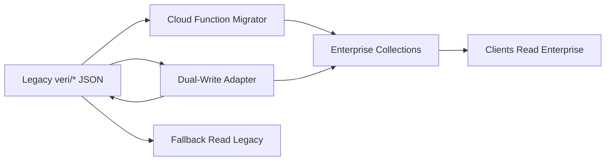

# METRİK ERP — Complete Firestore Database Design

> **Sürüm:** 2.0 Enterprise · 2026-07-03  
> **Platform:** Android · WPF · Firebase Auth · Firestore · FCM · Storage  
> **Durum:** Mevcut (Legacy) + Hedef (Enterprise) — migrasyon uyumlu

---

## İçindekiler

1. [Tasarım Prensipleri](#1-tasarım-prensipleri)
2. [Koleksiyon Haritası (Genel Bakış)](#2-koleksiyon-haritası-genel-bakış)
3. [Legacy Şema (Mevcut Üretim)](#3-legacy-şema-mevcut-üretim)
4. [Enterprise Şema (Hedef)](#4-enterprise-şema-hedef)
5. [Koleksiyon Detayları — Kimlik & Yetki](#5-koleksiyon-detayları--kimlik--yetki)
6. [Koleksiyon Detayları — Satınalma](#6-koleksiyon-detayları--satınalma)
7. [Koleksiyon Detayları — Depo & Stok](#7-koleksiyon-detayları--depo--stok)
8. [Koleksiyon Detayları — Master Data](#8-koleksiyon-detayları--master-data)
9. [Koleksiyon Detayları — Bildirim & Sistem](#9-koleksiyon-detayları--bildirim--sistem)
10. [Firebase Storage Yapısı](#10-firebase-storage-yapısı)
11. [Composite Indexes](#11-composite-indexes)
12. [Migrasyon Stratejisi](#12-migrasyon-stratejisi)
13. [Veri Bütünlüğü Kuralları](#13-veri-bütünlüğü-kuralları)

---

## 1. Tasarım Prensipleri

| Prensip | Açıklama |
|---------|----------|
| **Aggregate Root** | Talep (`procurement_requests`) kök varlık; teklif/kalem alt koleksiyon |
| **Immutable Audit** | `audit_log`, `notifications` silinmez |
| **User-Scoped Inbox** | Bildirim okuma state'i `users/{uid}/notification_inbox` |
| **Role-Based Access** | Security Rules + `users.rol` |
| **Optimistic Concurrency** | `updatedAt`, `guncellemeUtc` (ms) |
| **Backward Compatible** | Legacy `veri/*` JSON blob migrasyon sonrası read-only |
| **Denormalization** | `talepNo`, `firmaAdi`, `santiyeAdi` sorgu performansı için kopyalanır |
| **Soft Delete** | `deletedAt`, `silinenTalepIdleri` — fiziksel silme yok |

---

## 2. Koleksiyon Haritası (Genel Bakış)

```
firestore (default)
│
├── users/{uid}                                    ← Kimlik profili
│   ├── notification_inbox/{notificationId}        ← Kişisel inbox + read state
│   └── notification_settings/{categoryId}         ← Kullanıcı bildirim tercihleri
│
├── procurement_requests/{requestId}               ← Satınalma talebi (aggregate root)
│   ├── line_items/{lineItemId}                    ← Talep kalemleri
│   ├── quotes/{quoteId}                           ← Teklifler
│   │   └── quote_prices/{priceId}                 ← Kalem bazlı fiyat
│   ├── comments/{commentId}                       ← Yorumlar
│   ├── attachments/{attachmentId}                 ← Dosya metadata
│   └── audit_trail/{auditId}                      ← İşlem geçmişi
│
├── orders/{orderId}                               ← Sipariş
│   ├── order_lines/{lineId}                       ← Sipariş kalemleri
│   └── deliveries/{deliveryId}                      ← Teslimat kayıtları
│
├── returns/{returnId}                             ← İade
├── tasks/{taskId}                                 ← Görev / hatırlatma
│
├── suppliers/{supplierId}                         ← Tedarikçi master
├── sites/{siteId}                                 ← Şantiye master
├── materials/{materialId}                         ← Malzeme master
├── categories/{categoryId}                        ← Kategori
├── units/{unitId}                                 ← Birim
│
├── stock_items/{stockItemId}                      ← Stok kartı
├── stock_movements/{movementId}                 ← Stok hareketi
├── goods_receipts/{receiptId}                     ← Mal kabul fişi
│
├── notifications/{notificationId}               ← Master bildirim (immutable)
├── notification_queue/{queueId}                   ← FCM iş kuyruğu
├── notification_templates/{eventCode}             ← Bildirim şablonları
├── notification_delivery_log/{logId}              ← FCM teslimat audit
├── device_tokens/{tokenId}                        ← Cihaz FCM token
├── announcements/{announcementId}                 ← Sistem duyuruları
│
├── system_audit_log/{auditId}                     ← Sistem geneli audit
├── system_config/{configKey}                      ← Uygulama ayarları
├── email_templates/{templateId}                     ← E-posta şablonları
├── procurement_settings/{settingsId}              ← Satınalma ayarları (singleton: default)
│
└── veri/{legacyDocId}                             ← LEGACY JSON blob (deprecated)
    ├── satinalma_talepler
    ├── satinalma_ayarlar
    ├── stok, stok_hareketleri, alinan_malzemeler
    ├── bildirimler, agrega, cimento, akaryakit, filo
    ├── finansman_gelir, uygulama_ayarlar, medya, eposta_sablonlari
```

---

## 3. Legacy Şema (Mevcut Üretim)

Kaynak: `FirestoreYollari.cs`, `BulutVeriSenkronu.cs`, `FirestoreVeriServisi.cs`

### 3.1 JSON Blob Wrapper (Tüm `veri/*` belgeleri)

| Alan | Firestore Tipi | Zorunlu | Açıklama |
|------|----------------|---------|----------|
| `json` | string | ✓ | camelCase JSON payload |
| `updatedAt` | string (ISO8601) | ✓ | Son yazma zamanı |
| `updatedBy` | string | ✓ | Firebase UID |

### 3.2 Legacy Belge Envanteri

| Yol | JSON İçerik Tipi | Sync Anahtarı |
|-----|------------------|---------------|
| `veri/satinalma_talepler` | `List<SatinalmaTalep>` | `satinalma_talepler` |
| `veri/satinalma_ayarlar` | `SatinalmaAyarlar` | `satinalma_ayarlar` |
| `veri/stok` | `List<StokKaydi>` | `stok` |
| `veri/stok_hareketleri` | `List<StokHareketKaydi>` | `stok_hareket` |
| `veri/alinan_malzemeler` | `List<AlinanMalzemeKaydi>` | `malzeme` |
| `veri/bildirimler` | `List<BildirimKaydi>` | — |
| `veri/agrega` | Modül JSON | `agrega` |
| `veri/cimento` | Modül JSON | `cimento` |
| `veri/akaryakit` | Modül JSON | `akaryakit` |
| `veri/filo` | Modül JSON | `filo` |
| `veri/finansman_gelir` | Modül JSON | `finansman` |
| `veri/uygulama_ayarlar` | App settings | `uygulama_ayarlar` |
| `veri/medya` | MedyaPaketi | — |
| `veri/eposta_sablonlari` | E-posta şablonları | — |

### 3.3 Legacy `SatinalmaTalep` JSON Şeması (Gömülü)

Bkz. `SatinalmaPro.Shared/Models/SatinalmaTalep.cs` — Enterprise'da `procurement_requests` + alt koleksiyonlara ayrılır.

---

## 4. Enterprise Şema (Hedef)

Enterprise şema legacy ile **paralel çalışır**; Cloud Function migrasyon ve dual-write ile geçiş yapılır.

---

## 5. Koleksiyon Detayları — Kimlik & Yetki

### 5.1 `users/{uid}`

| Alan | Tip | Zorunlu | Index | Açıklama |
|------|-----|---------|-------|----------|
| `uid` | string | ✓ | PK | Firebase Auth UID |
| `eposta` | string | ✓ | ✓ unique | Giriş e-postası |
| `adSoyad` | string | ✓ | | Görünen ad |
| `rol` | string | ✓ | ✓ | Admin, Yönetim, Satınalma, Şef, Saha, Atölye, Depo |
| `aktif` | boolean | ✓ | ✓ | Hesap durumu |
| `saha` | string | | ✓ | Şantiye/saha kodu → `sites.siteCode` |
| `siteId` | string | | ✓ | FK → sites |
| `moduller` | string[] | | | Legacy modül listesi |
| `modulYetkileriJson` | string | | | JSON: ModulYetkiKaydi[] |
| `fcmToken` | string | | | Son FCM token (legacy; device_tokens tercih) |
| `unreadNotificationCount` | number | | | Denormalize badge |
| `createdAt` | timestamp | ✓ | | |
| `updatedAt` | timestamp | ✓ | | |
| `lastLoginAt` | timestamp | | | |
| `createdBy` | string | | | Admin UID |

**Alt koleksiyon:** `notification_inbox/{notificationId}`

| Alan | Tip | Açıklama |
|------|-----|----------|
| `notificationId` | string | FK → notifications |
| `eventCode` | string | Denormalize |
| `category` | string | talep, teklif, siparis, depo… |
| `type` | string | INFO, APPROVAL, TASK… |
| `priority` | string | LOW, MEDIUM, HIGH, CRITICAL |
| `title` | string | |
| `message` | string | |
| `module` | string | Navigasyon |
| `screen` | string | Navigasyon |
| `entityType` | string | |
| `entityId` | string | |
| `parentEntityId` | string | |
| `action` | string | |
| `deepLink` | string | |
| `metadata` | map | `{ talepNo, siparisNo, firmaAdi }` |
| `isRead` | boolean | Cross-platform sync |
| `readAt` | timestamp | |
| `isArchived` | boolean | |
| `archivedAt` | timestamp | |
| `isStarred` | boolean | Favori |
| `actedAt` | timestamp | Deep link açıldı |
| `dismissedAt` | timestamp | Toast kapatıldı |
| `localState` | string | DELIVERED, READ, ACTED, ARCHIVED |
| `deliveredAt` | timestamp | |
| `expiresAt` | timestamp | |

**Alt koleksiyon:** `notification_settings/{categoryId}`

| Alan | Tip | Açıklama |
|------|-----|----------|
| `category` | string | talep, teklif, siparis, depo, stok, iade, gorev, sistem |
| `enabled` | boolean | |
| `pushEnabled` | boolean | |
| `soundEnabled` | boolean | |
| `emailEnabled` | boolean | |
| `quietHoursStart` | string | "22:00" |
| `quietHoursEnd` | string | "07:00" |

---

## 6. Koleksiyon Detayları — Satınalma

### 6.1 `procurement_requests/{requestId}`

| Alan | Tip | Zorunlu | Index | Açıklama |
|------|-----|---------|-------|----------|
| `id` | string (UUID) | ✓ | PK | |
| `requestNo` | string | ✓ | ✓ | TLP-2026-001 |
| `requestDate` | string | ✓ | ✓ | |
| `requestType` | string | ✓ | ✓ | Normal, Acil |
| `status` | string | ✓ | ✓ | SatinalmaTalepDurumlari |
| `siteId` | string | | ✓ | FK → sites |
| `siteName` | string | | | Denormalize |
| `requesterName` | string | ✓ | | |
| `requesterUid` | string | ✓ | ✓ | olusturanUid |
| `requesterRole` | string | | | olusturanRol |
| `description` | string | | | |
| `rejectionReason` | string | | | redGerekcesi |
| `quoteRevisionNote` | string | | | teklifDuzeltmeNotu |
| `managementDecision` | string | | | Teklif İste, Doğrudan Onay, Reddet |
| `managementApproverUid` | string | | | |
| `managementApproverName` | string | | | |
| `managementApprovalDate` | string | | | |
| `managementApprovalLocked` | boolean | | | yonetimOnayKilitli |
| `directApprovalWithoutQuote` | boolean | | | teklifsizYonetimOnayi |
| `recommendedQuoteId` | string | | | yonetimOnerilenTeklifId |
| `manualRecommendationSelected` | boolean | | | satinalmaOnerisiElleSecildi |
| `approvedQuoteId` | string | | | onaylananTeklifId |
| `orderNo` | string | | ✓ | siparisNo |
| `firmOrderNumbers` | map | | | `{ quoteId: orderNo }` |
| `updatedAtUtc` | number | ✓ | ✓ | guncellemeUtc ms |
| `createdAt` | timestamp | ✓ | ✓ | |
| `updatedAt` | timestamp | ✓ | | |
| `deletedAt` | timestamp | | | Soft delete |
| `version` | number | ✓ | | Optimistic lock |

**Alt koleksiyon:** `line_items/{lineItemId}`

| Alan | Tip | Açıklama |
|------|-----|----------|
| `id` | string (UUID) | |
| `sequenceNo` | number | siraNo |
| `materialId` | string | FK → materials (opsiyonel) |
| `materialName` | string | |
| `quantity` | number | miktar |
| `unit` | string | birim |
| `description` | string | |
| `approvedQuoteId` | string | onaylananTeklifId |
| `acceptedQuantity` | number | kabulEdilenMiktar |
| `orderCompleted` | boolean | siparisTamamlandi |

**Alt koleksiyon:** `quotes/{quoteId}`

| Alan | Tip | Açıklama |
|------|-----|----------|
| `id` | string (UUID) | |
| `supplierId` | string | FK → suppliers |
| `supplierName` | string | firmaAdi |
| `brand` | string | marka |
| `paymentTermDays` | number | vadeGunu |
| `deliveryTime` | string | teslimSuresi |
| `paymentMethod` | string | odemeSekli |
| `vatRate` | number | kdvOrani |
| `description` | string | |
| `usdRate` | number | |
| `eurRate` | number | |
| `approved` | boolean | onaylandi |
| `totalAmount` | number | GenelToplam |
| `quoteDate` | string | |
| `attachmentUrl` | string | Storage URL |

**Alt koleksiyon:** `quotes/{quoteId}/quote_prices/{priceId}`

| Alan | Tip | Açıklama |
|------|-----|----------|
| `lineItemId` | string | kalemId |
| `brand` | string | |
| `currency` | string | TRY, USD, EUR |
| `unitPrice` | number | |
| `vatRate` | number | |
| `subtotal` | number | toplamTutar |
| `vatAmount` | number | kdvTutari |
| `totalWithVat` | number | toplamKdvDahil |

**Alt koleksiyon:** `comments/{commentId}`

| Alan | Tip |
|------|-----|
| `id`, `authorUid`, `authorName`, `text`, `createdAt` | |

**Alt koleksiyon:** `attachments/{attachmentId}`

| Alan | Tip |
|------|-----|
| `id`, `fileName`, `fileType`, `storagePath`, `downloadUrl`, `uploadedBy`, `uploadedAt`, `category` | PDF, Excel, Resim, Teklif, İrsaliye, Fatura |

**Alt koleksiyon:** `audit_trail/{auditId}`

| Alan | Tip |
|------|-----|
| `id`, `action`, `userUid`, `userName`, `timestamp`, `oldValue`, `newValue`, `fieldName`, `ipAddress` | Immutable |

### 6.2 `orders/{orderId}`

| Alan | Tip | Zorunlu | Index |
|------|-----|---------|-------|
| `id` | string (UUID) | ✓ | PK |
| `orderNo` | string | ✓ | ✓ |
| `requestId` | string | ✓ | ✓ |
| `requestNo` | string | ✓ | |
| `supplierId` | string | ✓ | ✓ |
| `supplierName` | string | ✓ | |
| `siteId` | string | | ✓ |
| `siteName` | string | | |
| `deliveryAddress` | string | | |
| `deliveryDate` | string | | ✓ |
| `status` | string | ✓ | ✓ | HAZIRLANIYOR, VERILDI, SEVKIYATTA, KISMI_TESLIM, TAM_TESLIM, IADE, IPTAL |
| `totalAmount` | number | | |
| `notes` | string | | |
| `pdfUrl` | string | | |
| `createdBy` | string | ✓ | |
| `createdAt` | timestamp | ✓ | ✓ |
| `updatedAt` | timestamp | ✓ | |

**Alt koleksiyon:** `order_lines/{lineId}`

| Alan | Tip |
|------|-----|
| `lineItemId`, `materialName`, `orderedQty`, `receivedQty`, `remainingQty`, `unit`, `unitPrice`, `status` | |

**Alt koleksiyon:** `deliveries/{deliveryId}`

| Alan | Tip |
|------|-----|
| `id`, `deliveryDate`, `receivedBy`, `warehouseNote`, `status`, `photoUrls[]`, `lineDeliveries[]` | Kısmi/Tam/Eksik/Fazla |

### 6.3 `returns/{returnId}`

| Alan | Tip | Index |
|------|-----|-------|
| `id`, `returnNo`, `orderId`, `requestId`, `supplierId`, `materialName`, `quantity`, `reason`, `status`, `createdBy`, `createdAt` | BEKLIYOR, SURECTE, TAMAMLANDI | ✓ status |

### 6.4 `tasks/{taskId}`

| Alan | Tip | Index |
|------|-----|-------|
| `id`, `title`, `description`, `taskType`, `assignedToUid`, `assignedByUid`, `dueDate`, `reminderAt`, `status`, `relatedEntityType`, `relatedEntityId`, `priority`, `createdAt` | ✓ assignedToUid, dueDate |

### 6.5 `procurement_settings/default` (Singleton)

| Alan | Tip | Legacy Karşılık |
|------|-----|-----------------|
| `companyName` | string | firmaAdi |
| `specificationText` | string | sartnameMetni |
| `quoteRequestSpecs` | string | teklifIstemeSartnameleri |
| `chiefSignatures` | array | sefImzalari |
| `managementSignatures` | array | yonetimImzalari |
| `lastRequestSequence` | number | sonTalepSira |
| `lastOrderSequence` | number | sonSiparisSira |
| `deletedRequestIds` | string[] | silinenTalepIdleri |
| `defaultUsdRate` | number | |
| `defaultEurRate` | number | |

---

## 7. Koleksiyon Detayları — Depo & Stok

### 7.1 `stock_items/{stockItemId}`

| Alan | Tip | Index | Legacy |
|------|-----|-------|--------|
| `id` | string | PK | |
| `materialId` | string | ✓ | |
| `materialName` | string | ✓ | malzemeAdi |
| `category` | string | ✓ | kategori |
| `unit` | string | | birim |
| `currentQuantity` | number | ✓ | mevcutMiktar |
| `minimumStock` | number | ✓ | minimumStok |
| `warehouseSite` | string | ✓ | depoSaha |
| `unitCost` | number | | birimMaliyet |
| `totalValue` | number | | toplamDeger |
| `lastUpdated` | string | | sonGuncelleme |
| `description` | string | | |
| `status` | string | ✓ | Normal, Kritik, Tükendi (computed) |

### 7.2 `stock_movements/{movementId}`

| Alan | Tip | Index |
|------|-----|-------|
| `id`, `date`, `movementType`, `materialName`, `category`, `unit`, `quantity`, `previousQuantity`, `countQuantity`, `warehouseSite`, `unitCost`, `documentNo`, `performedBy`, `deliveredTo`, `description`, `relatedOrderId`, `relatedRequestId`, `createdAt` | ✓ movementType, date |

`movementType`: Giriş, Çıkış, Sayım

### 7.3 `goods_receipts/{receiptId}`

| Alan | Tip | Index |
|------|-----|-------|
| `id`, `date`, `invoiceNo`, `category`, `materialName`, `quantity`, `unit`, `unitPrice`, `totalAmount`, `supplier`, `site`, `receivedBy`, `description`, `requestId`, `lineItemId`, `orderId`, `createdAt` | ✓ requestId |

Legacy: `AlinanMalzemeKaydi`

---

## 8. Koleksiyon Detayları — Master Data

### 8.1 `suppliers/{supplierId}`

| Alan | Tip | Index |
|------|-----|-------|
| `id`, `code`, `name`, `taxNo`, `phone`, `email`, `address`, `paymentTermDays`, `active`, `performanceScore`, `totalOrders`, `totalAmount`, `onTimeDeliveryRate`, `createdAt`, `updatedAt` | ✓ name, active |

### 8.2 `sites/{siteId}`

| Alan | Tip | Index |
|------|-----|-------|
| `id`, `code`, `name`, `address`, `managerUid`, `active`, `createdAt` | ✓ code, active |

### 8.3 `materials/{materialId}`

| Alan | Tip | Index |
|------|-----|-------|
| `id`, `code`, `name`, `categoryId`, `unitId`, `minimumStock`, `active`, `description`, `createdAt` | ✓ name, categoryId |

### 8.4 `categories/{categoryId}`

| Alan | Tip |
|------|-----|
| `id`, `name`, `parentId`, `sortOrder`, `active` | |

### 8.5 `units/{unitId}`

| Alan | Tip |
|------|-----|
| `id`, `name`, `symbol`, `active` | Adet, Kg, Metre, Litre, Ton |

---

## 9. Koleksiyon Detayları — Bildirim & Sistem

### 9.1 `notifications/{notificationId}` (Master — Immutable)

| Alan | Tip | Index |
|------|-----|-------|
| `id`, `eventCode`, `category`, `type`, `priority`, `title`, `message`, `module`, `screen`, `entityType`, `entityId`, `parentEntityId`, `action`, `deepLink`, `targetRoles[]`, `targetUids[]`, `createdBy`, `createdByName`, `createdAt`, `expiresAt`, `metadata`, `immutable` | ✓ eventCode, createdAt |

### 9.2 `notification_queue/{queueId}`

| Alan | Tip | Index |
|------|-----|-------|
| `id`, `notificationId`, `status`, `retryCount`, `maxRetries`, `payload`, `scheduledAt`, `processedAt`, `errorMessage` | ✓ status, scheduledAt |

`status`: PENDING, PROCESSING, SENT, FAILED, DEAD_LETTER

### 9.3 `notification_templates/{eventCode}`

| Alan | Tip |
|------|-----|
| `eventCode`, `category`, `type`, `defaultPriority`, `titleTemplate`, `messageTemplate`, `targetRoles[]`, `module`, `screen`, `action`, `enabled` | |

### 9.4 `notification_delivery_log/{logId}`

| Alan | Tip | Index |
|------|-----|-------|
| `id`, `notificationId`, `uid`, `deviceToken`, `platform`, `status`, `fcmMessageId`, `sentAt`, `errorCode` | ✓ notificationId, sentAt |

### 9.5 `device_tokens/{tokenId}`

| Alan | Tip | Index |
|------|-----|-------|
| `id`, `uid`, `token`, `platform`, `deviceId`, `appVersion`, `appPackage`, `lastSeenAt`, `active` | ✓ uid, active; ✓ token |

### 9.6 `announcements/{announcementId}`

| Alan | Tip |
|------|-----|
| `id`, `title`, `body`, `priority`, `targetRoles[]`, `publishedBy`, `publishedAt`, `expiresAt`, `active` | |

### 9.7 `system_audit_log/{auditId}`

| Alan | Tip | Index |
|------|-----|-------|
| `id`, `action`, `entityType`, `entityId`, `userUid`, `userName`, `userRole`, `timestamp`, `oldValue`, `newValue`, `clientPlatform`, `ipAddress` | ✓ entityType, timestamp |

### 9.8 `system_config/{configKey}`

| Alan | Tip |
|------|-----|
| `key`, `value`, `updatedBy`, `updatedAt` | maintenance_mode, min_app_version |

### 9.9 `email_templates/{templateId}`

| Alan | Tip |
|------|-----|
| `id`, `eventCode`, `subject`, `bodyHtml`, `active` | |

---

## 10. Firebase Storage Yapısı

```
gs://{bucket}/
├── procurement/
│   └── {requestId}/
│       ├── attachments/{fileId}_{fileName}
│       ├── photos/{fileId}_{fileName}
│       └── quotes/{quoteId}/{fileName}
├── orders/
│   └── {orderId}/
│       ├── pdf/{orderNo}.pdf
│       ├── irsaliye/{fileName}
│       └── fatura/{fileName}
├── returns/
│   └── {returnId}/photos/{fileName}
├── stock/
│   └── receipts/{receiptId}/{fileName}
├── system/
│   ├── logos/{fileName}
│   └── signatures/{role}/{fileName}
└── temp/
    └── {uid}/{uploadId}          ← 24h TTL (Cloud Function cleanup)
```

**Metadata (Storage custom metadata):**

| Key | Değer |
|-----|-------|
| `uploadedBy` | UID |
| `entityType` | talep, siparis, iade |
| `entityId` | UUID |
| `fileCategory` | PDF, Excel, Resim, Teklif, İrsaliye, Fatura |

---

## 11. Composite Indexes

Tam tanım: [`firestore.indexes.json`](../firestore.indexes.json)

### 11.1 Kritik Sorgular → Index Gereksinimleri

| Koleksiyon | Sorgu | Index Alanları |
|------------|-------|----------------|
| `procurement_requests` | Durum + tarih | `status ASC, createdAt DESC` |
| `procurement_requests` | Şantiye + durum | `siteId ASC, status ASC, createdAt DESC` |
| `procurement_requests` | Talep eden | `requesterUid ASC, createdAt DESC` |
| `orders` | Durum + teslim tarihi | `status ASC, deliveryDate ASC` |
| `orders` | Talep FK | `requestId ASC, createdAt DESC` |
| `stock_items` | Kritik stok | `status ASC, currentQuantity ASC` |
| `stock_movements` | Malzeme + tarih | `materialName ASC, date DESC` |
| `users/{uid}/notification_inbox` | Okunmamış | `isRead ASC, deliveredAt DESC` |
| `users/{uid}/notification_inbox` | Kategori | `category ASC, deliveredAt DESC` |
| `users/{uid}/notification_inbox` | Arşiv | `isArchived ASC, archivedAt DESC` |
| `tasks` | Atanan + deadline | `assignedToUid ASC, dueDate ASC` |
| `returns` | Durum | `status ASC, createdAt DESC` |
| `device_tokens` | Aktif cihazlar | `uid ASC, active ASC` |
| `notifications` | Audit | `createdAt DESC` |
| `system_audit_log` | Entity audit | `entityType ASC, timestamp DESC` |

---

## 12. Migrasyon Stratejisi



| Faz | İşlem |
|-----|-------|
| 0 | Enterprise koleksiyonlar oluştur; Security Rules deploy |
| 1 | Dual-write: yeni talep hem legacy hem enterprise |
| 2 | Batch migrator: mevcut `satinalma_talepler` → `procurement_requests` |
| 3 | Bildirimler: `veri/bildirimler` → `notifications` + inbox |
| 4 | Client read switch: enterprise primary |
| 5 | Legacy read-only; 90 gün sonra deprecated |

---

## 13. Veri Bütünlüğü Kuralları

| Kural | Uygulama |
|-------|----------|
| Talep silme | Soft delete + `deletedRequestIds` |
| Audit immutable | Security Rules: audit_trail create-only |
| Sipariş ↔ Talep | `orders.requestId` FK zorunlu |
| Mal kabul ↔ Kalem | `goods_receipts.lineItemId` FK |
| Stok hareket | Transaction: movement + stock_items update |
| Bildirim fan-out | Cloud Function; client doğrudan notifications yazamaz |
| Concurrent edit | `guncellemeUtc` / `version` — yüksek kazanır |
| Teklif onay | Kalem `approvedQuoteId` + quote `approved=true` atomik batch |

---

*İlgili: [FIRESTORE_SECURITY_RULES.md](./FIRESTORE_SECURITY_RULES.md) · [ERP_WORKFLOW_COMPLETE.md](./ERP_WORKFLOW_COMPLETE.md)*
