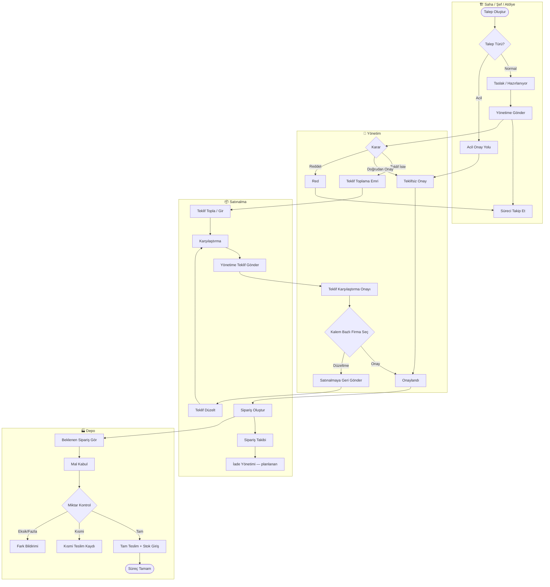
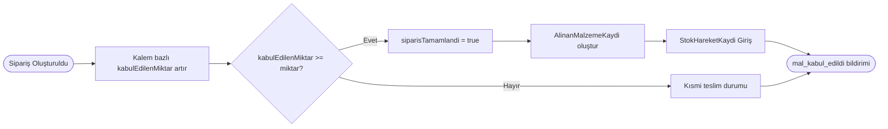
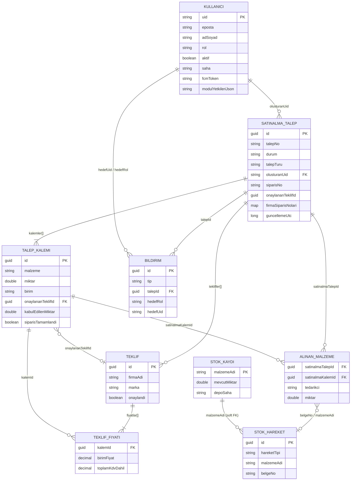
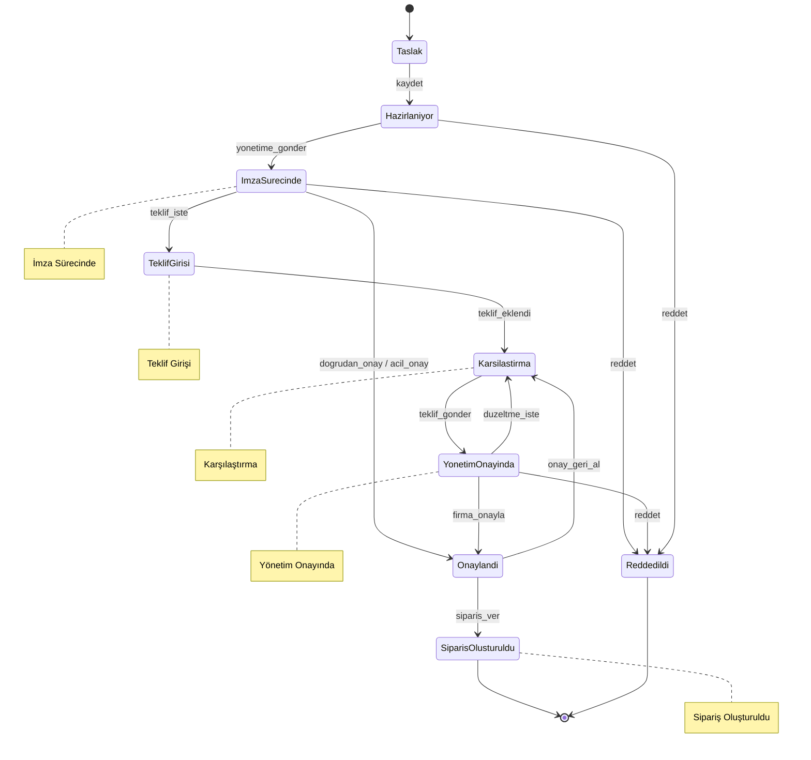
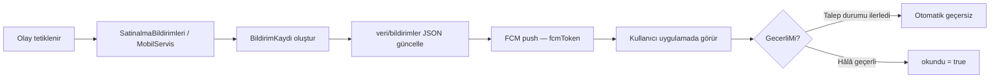

# METRİK ERP — Satınalma Sistemi Teknik Dokümantasyonu

> **Sürüm:** 2026-07-03  
> **Kapsam:** WPF Masaüstü · MAUI Mobil · Android Rol Uygulamaları · Firebase/Firestore  
> **Kaynak kod:** `SatinalmaPro.Shared`, `Satinalma Pro`, `SatinalmaPro.Mobile`, `SatinalmaPro.*` (Android)

---

## İçindekiler

1. [Sistem Özeti](#1-sistem-özeti)
2. [BPMN 2.0 İş Akış Diyagramı](#2-bpmn-20-iş-akış-diyagramı)
3. [ER Diagram (ERD)](#3-er-diagram-erd)
4. [Firestore Koleksiyon Şeması](#4-firestore-koleksiyon-şeması)
5. [Rol Yetki Matrisi (RBAC)](#5-rol-yetki-matrisi-rbac)
6. [Durum Geçiş Matrisi (State Machine)](#6-durum-geçiş-matrisi-state-machine)
7. [Bildirim Matrisi](#7-bildirim-matrisi)
8. [Hedef ERP Genişletmesi (Planlanan)](#8-hedef-erp-genişletmesi-planlanan)

---

## 1. Sistem Özeti

METRİK satınalma modülü **talep merkezli (request-centric)** bir iş akışı kullanır. Teklif, sipariş ve teslimat ayrı Firestore koleksiyonlarında değil; **`SatinalmaTalep`** aggregate kökü altında gömülü alt nesneler ve türetilmiş durumlar olarak modellenir.

| Katman | Teknoloji | Rol |
|--------|-----------|-----|
| Masaüstü ERP | C# · .NET 9 · WPF · MVVM | Tam operasyon merkezi |
| Mobil | .NET MAUI | Saha / yönetim / satınalma |
| Android | Kotlin · Compose · MVVM | Rol bazlı uygulamalar (mock + Firebase stub) |
| Bulut | Firebase Auth · Firestore · FCM | Kimlik, veri, push bildirim |

**Veri kalıcılık deseni:** Çoğu veri seti `veri/{anahtar}` yolunda **tek doküman + JSON blob** (`json` alanı) olarak saklanır. İstisna: `users/{uid}` yapılandırılmış alanlar içerir.

---

## 2. BPMN 2.0 İş Akış Diyagramı

Aşağıdaki diyagram BPMN 2.0 mantığında **swimlane (havuz)** yapısında ana satınalma sürecini gösterir. Gerçek durum adları `SatinalmaTalepDurumlari` sabitlerinden alınmıştır.

### 2.1 Ana Süreç — Normal Talep (Teklifli)



### 2.2 BPMN Olay ve Kapı Özeti

| BPMN Öğesi | Karşılık | Tetikleyen Rol |
|------------|----------|----------------|
| **Start Event** | Talep oluşturma | Saha, Şef, Atölye, Satınalma |
| **Exclusive Gateway (XOR)** | Normal / Acil talep türü | Oluşturan |
| **User Task** | Teklif girişi | Satınalma |
| **User Task** | Yönetim kararı | Yönetim |
| **User Task** | Sipariş oluşturma | Satınalma |
| **User Task** | Mal kabul | Depo |
| **End Event** | Tüm kalemler tam teslim + stok girişi | Depo / Satınalma |
| **Terminate Event** | Reddedildi | Yönetim |

### 2.3 Alt Süreç — Mal Kabul (Depo)



---

## 3. ER Diagram (ERD)

### 3.1 Üretim Şeması (Firestore — Mevcut)



### 3.2 Varlık İlişki Notları

| İlişki | Kardinalite | Açıklama |
|--------|-------------|----------|
| Kullanıcı → Talep | 1:N | `olusturanUid` ile sahiplik |
| Talep → Kalem | 1:N | Gömülü dizi; malzeme metin (hard FK yok) |
| Talep → Teklif | 1:N | Firma teklifleri talep içinde |
| Kalem → Teklif | N:1 | Kalem bazlı firma onayı (`onaylananTeklifId`) |
| Talep → Sipariş | 1:1 (mantıksal) | `durum=Sipariş Oluşturuldu`, `siparisNo` |
| Kalem → Teslimat | 1:1 (türetilmiş) | `kabulEdilenMiktar`, `siparisTamamlandi` |
| Talep → Alınan Malzeme | 1:N | Mal kabul fişi |
| Stok ↔ Malzeme | Soft FK | `malzemeAdi` string eşleşmesi |

> **Not:** Ayrı `Firma`, `Şantiye`, `Sipariş`, `Teslimat`, `İade` koleksiyonları üretim Firestore'da **yoktur**. Firma = `teklif.firmaAdi`; şantiye = `kullanici.saha`.

---

## 4. Firestore Koleksiyon Şeması

### 4.1 Genel JSON Blob Deseni

```
veri/{dataset}
├── json: string          ← camelCase JSON (tüm kayıt dizisi veya nesne)
├── updatedAt: string     ← ISO 8601
└── updatedBy: string     ← Firebase UID
```

Kaynak: `SatinalmaPro.Shared/Services/Firebase/FirestoreVeriServisi.cs`

---

### 4.2 Koleksiyon Envanteri

| Firestore Yolu | Sync Anahtarı | İçerik Tipi | Modül |
|----------------|---------------|-------------|-------|
| `users/{uid}` | — | `KullaniciProfili` | Kimlik |
| `veri/satinalma_talepler` | `satinalma_talepler` | `List<SatinalmaTalep>` | Satınalma |
| `veri/satinalma_ayarlar` | `satinalma_ayarlar` | `SatinalmaAyarlar` | Satınalma |
| `veri/bildirimler` | — | `List<BildirimKaydi>` | Bildirim |
| `veri/stok` | `stok` | `List<StokKaydi>` | Depo |
| `veri/stok_hareketleri` | `stok_hareket` | `List<StokHareketKaydi>` | Depo |
| `veri/alinan_malzemeler` | `malzeme` | `List<AlinanMalzemeKaydi>` | Malzeme |
| `veri/agrega` | `agrega` | Modül JSON | Agrega |
| `veri/cimento` | `cimento` | Modül JSON | Çimento |
| `veri/akaryakit` | `akaryakit` | Modül JSON | Akaryakıt |
| `veri/filo` | `filo` | Modül JSON | Filo |
| `veri/finansman_gelir` | `finansman` | Modül JSON | Finans |
| `veri/uygulama_ayarlar` | `uygulama_ayarlar` | Uygulama ayarları | Sistem |
| `veri/medya` | — | Logo/medya paketi | Sistem |
| `veri/eposta_sablonlari` | — | E-posta şablonları | Sistem |

Kaynak: `SatinalmaPro.Shared/FirestoreYollari.cs`, `Satinalma Pro/Services/BulutVeriSenkronu.cs`

---

### 4.3 `users/{uid}` — Alan Şeması

| Alan | Tip | Zorunlu | Açıklama |
|------|-----|---------|----------|
| `eposta` | string | ✓ | Giriş e-postası |
| `adSoyad` | string | ✓ | Görünen ad |
| `rol` | string | ✓ | `Admin`, `Yönetim`, `Satınalma`, `Şef`, `Saha`, `Atölye`, `Depo` |
| `aktif` | boolean | ✓ | Hesap durumu |
| `saha` | string | | Şantiye / saha ataması |
| `moduller` | string[] | | Legacy modül listesi |
| `modulYetkileriJson` | string | | `List<ModulYetkiKaydi>` JSON |
| `fcmToken` | string | | Push bildirim token |

---

### 4.4 `veri/satinalma_talepler` → `SatinalmaTalep`

| Alan | Tip | Açıklama |
|------|-----|----------|
| `id` | Guid | Birincil anahtar |
| `talepNo` | string | TLP-YYYY-NNN |
| `tarih` | string | Talep tarihi |
| `talepEden` | string | Talep eden kişi adı |
| `talepAciklamasi` | string | Açıklama |
| `talepTuru` | string | `"Normal"` \| `"Acil"` |
| `olusturanUid` | string | Oluşturan Firebase UID |
| `olusturanRol` | string | Oluşturan rol (iç teklif akışı) |
| `durum` | string | Bkz. [§6 Durum Geçiş Matrisi](#6-durum-geçiş-matrisi-state-machine) |
| `redGerekcesi` | string | Red nedeni |
| `teklifDuzeltmeNotu` | string | Yönetim geri gönderim notu |
| `guncellemeUtc` | long | UTC ms — çakışma çözümü |
| `yonetimOnerilenTeklifId` | Guid? | Satınalma önerisi |
| `satinalmaOnerisiElleSecildi` | bool | Manuel öneri bayrağı |
| `siparisNo` | string | Ana sipariş numarası |
| `onaylananTeklifId` | Guid? | Birincil onaylı teklif |
| `firmaSiparisNolari` | map\<Guid,string\> | Firma bazlı sipariş no |
| `yonetimOnaylayanUid/Ad/Eposta` | string | Onaylayan bilgisi |
| `yonetimOnayTarihi` | string | Onay zamanı |
| `yonetimOnayKilitli` | bool |with | Onay sonrası kilit |
| `teklifsizYonetimOnayi` | bool | Teklifsiz doğrudan onay |
| `kalemler` | array | `SatinalmaTalepKalemi[]` |
| `teklifler` | array | `SatinalmaTeklif[]` |

#### Gömülü: `SatinalmaTalepKalemi`

| Alan | Tip |
|------|-----|
| `id`, `siraNo`, `malzeme`, `miktar`, `birim`, `aciklama` | |
| `onaylananTeklifId` | Guid? — onaylı firma |
| `kabulEdilenMiktar` | double — teslim alınan |
| `siparisTamamlandi` | bool |

#### Gömülü: `SatinalmaTeklif`

| Alan | Tip |
|------|-----|
| `id`, `firmaAdi`, `marka`, `vadeGunu`, `teslimSuresi`, `odemeSekli` | |
| `kdvOrani`, `aciklama`, `usdKuru`, `eurKuru` | |
| `onaylandi` | bool |
| `fiyatlar` | `SatinalmaTeklifFiyati[]` |

#### Gömülü: `SatinalmaTeklifFiyati`

| Alan | Tip |
|------|-----|
| `kalemId`, `marka`, `paraBirimi`, `birimFiyat`, `kdvOrani` | |
| `toplamTutar`, `kdvTutari`, `toplamKdvDahil` | |

---

### 4.5 `veri/satinalma_ayarlar` → `SatinalmaAyarlar`

| Alan | Tip |
|------|-----|
| `firmaAdi`, `sartnameMetni`, `teklifIstemeSartnameleri` | |
| `sefImzalari`, `yonetimImzalari` | ImzaAyari[] |
| `sonTalepSira`, `sonSiparisSira` | int |
| `silinenTalepIdleri` | Guid[] |
| `varsayilanUsdKuru`, `varsayilanEurKuru` | decimal |

---

### 4.6 `veri/bildirimler` → `BildirimKaydi`

| Alan | Tip |
|------|-----|
| `id` | Guid |
| `baslik`, `mesaj` | string |
| `tip` | string — `BildirimTipleri` sabiti |
| `talepId` | Guid? |
| `hedefRol` | string? |
| `hedefUid` | string? |
| `olusturanUid`, `olusturanAd` | string |
| `olusturmaTarihi` | string |
| `okundu` | bool |
| `guncellemeUtc` | long |

---

### 4.7 `veri/stok` → `StokKaydi`

| Alan | Tip |
|------|-----|
| `malzemeAdi`, `kategori`, `birim` | string |
| `mevcutMiktar`, `minimumStok` | double |
| `depoSaha` | string |
| `birimMaliyet`, `toplamDeger` | decimal |
| `sonGuncelleme`, `aciklama` | string |

---

### 4.8 `veri/stok_hareketleri` → `StokHareketKaydi`

| Alan | Tip | Değerler |
|------|-----|----------|
| `hareketTipi` | string | `"Giriş"`, `"Çıkış"`, `"Sayım"` |
| `malzemeAdi`, `kategori`, `birim` | string | |
| `miktar`, `oncekiMiktar`, `sayimMiktar` | double | |
| `depoSaha`, `belgeNo`, `islemYapan`, `teslimEdilen` | string | |
| `birimMaliyet` | decimal | |

---

### 4.9 `veri/alinan_malzemeler` → `AlinanMalzemeKaydi`

| Alan | Tip |
|------|-----|
| `tarih`, `faturaNo`, `kategori`, `malzemeHizmet` | |
| `miktar`, `birim`, `birimFiyati`, `toplamTutar` | |
| `tedarikci`, `indirildigiSaha`, `teslimAlan` | |
| `satinalmaTalepId`, `satinalmaKalemId` | Guid — talep bağlantısı |

---

## 5. Rol Yetki Matrisi (RBAC)

### 5.1 Rol Tanımları

| Rol | Kod | Açıklama |
|-----|-----|----------|
| Admin | `Admin` | Tüm yetkiler + sistem yönetimi |
| Yönetim | `Yönetim` | Onay, teklif karşılaştırma, red |
| Satınalma | `Satınalma` | Tam operasyon yetkisi |
| Şef | `Şef` | Talep + takip + onaylanan malzeme |
| Saha | `Saha` | Talep oluştur/takip (teklif yok) |
| Atölye | `Atölye` | Stok görüntüle + talep |
| Depo | `Depo` | Stok hareketleri + mal kabul |

Legacy: `Şantiye` → `Şef`, `Okuma` → `Saha`

Kaynak: `SatinalmaPro.Shared/Models/KullaniciRolleri.cs`

---

### 5.2 Satınalma Modülü — İşlem Yetkileri

| İşlem | Admin | Yönetim | Satınalma | Şef | Saha | Atölye | Depo |
|-------|:-----:|:-------:|:---------:|:---:|:----:|:------:|:----:|
| Talep oluştur | ✓ | ✓ | ✓ | ✓ | ✓ | ✓ | — |
| Tüm talepleri görüntüle | ✓ | ✓ | ✓ | ✓ | ✓ | ✓ | — |
| Kendi talebini düzenle/sil (onay öncesi) | ✓ | — | ✓ | ✓* | ✓* | ✓* | — |
| Tüm talepleri düzenle/sil | ✓ | — | ✓ | — | — | — | — |
| Teklifleri görüntüle | ✓ | ✓ | ✓ | — | — | — | — |
| Teklif ekle/düzenle/sil | ✓ | — | ✓ | — | — | — | — |
| Teklifleri yönetime gönder | ✓ | — | ✓ | — | — | — | — |
| Acil talep onayla/reddet | ✓ | ✓ | — | — | — | — | — |
| Normal talep: Teklif İste | ✓ | ✓ | — | — | — | — | — |
| Normal talep: Doğrudan Onayla | ✓ | ✓ | — | — | — | — | — |
| Normal talep: Reddet | ✓ | ✓ | — | — | — | — | — |
| Teklif karşılaştır / firma seç | ✓ | ✓ | ✓ | — | — | — | — |
| Sipariş oluştur/düzenle | ✓ | — | ✓ | — | — | — | — |
| Beklenen sipariş takibi | ✓ | ✓ | ✓ | — | — | — | ✓ |
| Mal kabul (kısmi/tam) | ✓ | — | ✓ | — | — | — | ✓ |
| İade süreci yönetimi | ✓ | — | ✓ | — | — | — | — |
| Stok görüntüle | ✓ | ✓ | ✓ | ✓ | ✓ | ✓ | ✓ |
| Stok giriş/çıkış/sayım | ✓ | — | ✓ | — | — | — | ✓ |
| Tedarikçi yönetimi | ✓ | — | ✓ | — | — | — | — |

\* Yalnızca kendi talebi (`olusturanUid` eşleşmesi) ve yönetim işlemi başlamadan önce.

---

### 5.3 Admin — Sistem Yönetimi Ek Yetkileri

| Ekran / İşlem | Admin |
|---------------|:-----:|
| Kullanıcı Yönetimi | ✓ |
| Rol Yönetimi | ✓ |
| Şantiye Yönetimi | ✓ |
| Malzeme Yönetimi | ✓ |
| Kategori / Birim Yönetimi | ✓ |
| Firma Yönetimi | ✓ |
| Sistem Logları | ✓ |
| Yetki Yönetimi (`modulYetkileriJson`) | ✓ |
| Sistem Ayarları | ✓ |
| Bildirim Yönetimi | ✓ |

---

### 5.4 Modül Erişim Matrisi (Masaüstü)

| Modül | Admin | Yönetim | Satınalma | Şef | Saha | Atölye | Depo |
|-------|:-----:|:-------:|:---------:|:---:|:----:|:------:|:----:|
| Satınalma | ✓ | ✓ | ✓ | ✓ | ✓ | ✓ | — |
| Stok Yönetimi | ✓ | ✓ R | ✓ | ✓ R | ✓ R | ✓ R | ✓ |
| Alınan Malzemeler | ✓ | — | ✓ | ✓ R | — | — | — |
| Agrega / Çimento | ✓ | — | ✓ | ✓ R | — | — | — |
| Filo / Finans / Rapor | ✓ | — | ✓ | — | — | — | — |
| Ayarlar | ✓ | — | — | — | — | — | — |

R = Salt okunur (yazma kısıtlı)

Kaynak: `MasaustuRolHaritasi.cs`, `KullaniciYetkileri.cs`

---

### 5.5 Satınalma Sekme Görünürlüğü (Mobil / Masaüstü)

| Sekme | Admin | Yönetim | Satınalma | Şef | Saha | Atölye | Depo |
|-------|:-----:|:-------:|:---------:|:---:|:----:|:------:|:----:|
| Taleplerim | ✓ | — | ✓ | ✓ | ✓ | — | — |
| Yeni Talep | ✓ | — | ✓ | ✓ | ✓ | — | — |
| Gelen Talepler | ✓ | ✓ | ✓ | — | — | — | — |
| Teklif Girişi | ✓ | — | ✓ | — | — | — | — |
| Karşılaştırma | ✓ | — | ✓ | — | — | — | — |
| Teklif Onay | ✓ | ✓ | ✓ | — | — | — | — |
| Alınan Malzemeler | ✓ | — | ✓ | ✓ | — | — | — |
| Onay Bekleyen | ✓ | — | ✓ | ✓ | ✓ | — | — |

Kaynak: `RolNavigasyonu.cs`

---

### 5.6 Yetki Çözümleme Sırası

```
1. Admin mi? → Tam erişim
2. Kullanıcıya özel modulYetkileriJson var mı? → Özel yetki
3. Legacy moduller[] listesi var mı? → Liste bazlı
4. Rol varsayılan haritası → RolNavigasyonu / MasaustuRolHaritasi
```

---

## 6. Durum Geçiş Matrisi (State Machine)

### 6.1 Talep Durumları (`SatinalmaTalepDurumlari`)

| Durum | Skor | Açıklama |
|-------|------|----------|
| `Taslak` | 0 | İlk kayıt |
| `Hazırlanıyor` | 20 | Düzenleme aşaması |
| `İmza Sürecinde` | 30 | Yönetime iletildi (teklifsiz) |
| `Teklif Girişi` | 40 | Teklif toplama |
| `Karşılaştırma` | 50 | Teklifler karşılaştırılıyor |
| `Yönetim Onayında` | 60 | Yönetim teklif onayı bekliyor |
| `Onaylandı` | 70 | Firma/kalem onayı tamam |
| `Reddedildi` | 15 | Talep reddedildi (terminal) |
| `Sipariş Oluşturuldu` | 90 | Sipariş verildi (terminal*) |

\* Teslimat alt süreci devam edebilir.

Kaynak: `SatinalmaPro.Shared/Models/SatinalmaTalep.cs`

---

### 6.2 Durum Geçiş Tablosu — Normal Akış

| # | Kaynak Durum | Hedef Durum | Olay / Aksiyon | Rol | Koşul |
|---|--------------|-------------|----------------|-----|-------|
| 1 | `Taslak` | `Hazırlanıyor` | Kaydet | Oluşturan | Kalemler dolu |
| 2 | `Hazırlanıyor` | `İmza Sürecinde` | Yönetime gönder | Oluşturan / Satınalma | Teklif yok |
| 3 | `İmza Sürecinde` | `Teklif Girişi` | Yönetim: Teklif İste | Yönetim | Normal talep |
| 4 | `İmza Sürecinde` | `Onaylandı` | Yönetim: Doğrudan Onay / Acil Onay | Yönetim | Acil veya teklifsiz |
| 5 | `Teklif Girişi` | `Karşılaştırma` | Teklif eklendi / düzenlendi | Satınalma | ≥1 teklif |
| 6 | `Karşılaştırma` | `Yönetim Onayında` | Yönetime teklif gönder | Satınalma | Teklifler tamam |
| 7 | `Yönetim Onayında` | `Karşılaştırma` | Teklif revizyonu / geri gönder | Yönetim / Satınalma | Düzeltme gerekli |
| 8 | `Yönetim Onayında` | `Onaylandı` | Kalem bazlı firma onayı | Yönetim | Tüm kalemler onaylı |
| 9 | `*` | `Reddedildi` | Reddet | Yönetim | — |
| 10 | `Onaylandı` | `Sipariş Oluşturuldu` | Sipariş ver | Satınalma | Onay kilitli |
| 11 | `Onaylandı` | `Karşılaştırma` | Firma onaylarını geri al | Satınalma | Sipariş öncesi |
| 12 | `Sipariş Oluşturuldu` | `Onaylandı` | Sipariş iptali (nadir) | Satınalma | — |

Kaynak: `SatinalmaYonetimIslemleri.cs`, `SatinalmaYonetimGonderimi.cs`, `SatinalmaSiparisIslemleri.cs`, `SatinalmaMobilServisi.cs`

---

### 6.3 Durum Geçiş Diyagramı (State Machine)



---

### 6.4 Teklif Durumu (Gömülü — Ayrı Enum Yok)

| Durum | Koşul | Açıklama |
|-------|-------|----------|
| **Taslak** | `onaylandi = false`, teklif giriliyor | Aktif düzenleme |
| **Aktif** | Teklif tam, karşılaştırmada | Yönetim değerlendirmesinde |
| **Önerilen** | `yonetimOnerilenTeklifId = teklif.id` | Satınalma önerisi |
| **Onaylı** | `onaylandi = true` veya kalem `onaylananTeklifId` | Seçilmiş firma |
| **Reddedilmiş** | Başka teklif onaylandı | Seçilmemiş |

---

### 6.5 Kalem Teslimat Durumu (Türetilmiş — State Machine)

| Durum | Koşul | Alanlar |
|-------|-------|---------|
| **Bekliyor** | `kabulEdilenMiktar = 0` | Sipariş sonrası |
| **Kısmi** | `0 < kabulEdilenMiktar < miktar` | Depo kısmi kabul |
| **Tamamlandı** | `kabulEdilenMiktar >= miktar` | `siparisTamamlandi = true` |

Tetikleyen: `SatinalmaSiparisIslemleri` → mal kabul → `AlinanMalzemeKaydi` + `StokHareketKaydi`

---

### 6.6 Stok Hareket Durumları

| `hareketTipi` | Anlam | Rol |
|---------------|-------|-----|
| `Giriş` | Mal kabul / stok artışı | Depo, Satınalma |
| `Çıkış` | Stok tüketimi | Depo |
| `Sayım` | Envanter düzeltmesi | Depo |

---

## 7. Bildirim Matrisi

### 7.1 Üretim Bildirim Tipleri (`BildirimTipleri`)

Kaynak: `SatinalmaPro.Shared/Models/BildirimKaydi.cs`, `SatinalmaBildirimleri.cs`

| Tip Kodu | Türkçe Başlık | Tetikleyen Olay | Kaynak Durum → Hedef | Hedef Rol / UID | FCM Route |
|----------|---------------|-----------------|----------------------|-----------------|-----------|
| `yonetime_gonderildi` | Yönetime Gönderildi | Talep yönetime iletildi | Hazırlanıyor → İmza Sürecinde | Yönetim, Satınalma | `gelen-talepler` |
| `teklif_istendi` | Teklif İstendi | Yönetim teklif talep etti | İmza Sürecinde → Teklif Girişi | Satınalma | `teklif-bekleyen` |
| `teklif_onayda` | Teklif Onayda | Teklifler yönetime gönderildi | Karşılaştırma → Yönetim Onayında | Yönetim | `teklif-onay` |
| `teklif_duzeltme_istendi` | Teklif Düzeltme | Yönetim geri gönderdi | Yönetim Onayında → Karşılaştırma | Satınalma | `teklif-gir` |
| `onaylandi` | Onaylandı | Talep/firma onaylandı | * → Onaylandı | Satınalma + oluşturan UID | `onaylanan-talepler` |
| `reddedildi` | Reddedildi | Talep reddedildi | * → Reddedildi | Oluşturan UID | `red-talepler` |
| `siparis_olusturuldu` | Sipariş Oluşturuldu | Sipariş verildi | Onaylandı → Sipariş Oluşturuldu | Satınalma + oluşturan UID | `onaylanan-malzemeler` |
| `mal_kabul_edildi` | Mal Kabul Edildi | Depo mal kabul yaptı | Sipariş Oluşturuldu (devam) | Satınalma, Depo, oluşturan | `onaylanan-malzemeler` |

---

### 7.2 Bildirim × Rol Teslimat Matrisi

| Bildirim | Admin | Yönetim | Satınalma | Şef | Saha | Atölye | Depo |
|----------|:-----:|:-------:|:---------:|:---:|:----:|:------:|:----:|
| Yönetime Gönderildi | ✓ | ✓ | ✓ | — | — | — | — |
| Teklif İstendi | ✓ | — | ✓ | — | — | — | — |
| Teklif Onayda | ✓ | ✓ | — | — | — | — | — |
| Teklif Düzeltme | ✓ | — | ✓ | — | — | — | — |
| Onaylandı | ✓ | — | ✓ | ✓* | ✓* | — | — |
| Reddedildi | ✓ | — | — | ✓* | ✓* | — | — |
| Sipariş Oluşturuldu | ✓ | — | ✓ | ✓* | ✓* | — | — |
| Mal Kabul Edildi | ✓ | — | ✓ | ✓* | ✓* | — | ✓ |

\* Yalnızca kendi talebi (`hedefUid = olusturanUid`)

---

### 7.3 Bildirim Yaşam Döngüsü



Kaynak: `BildirimFiltreleme.GecerliMi()`

---

### 7.4 Android Mock Bildirim Tipleri (Hedef ERP)

Satınalma Merkezi ve Android uygulamalarında planlanan ek tipler:

| Mock Tip | Üretim Karşılığı | Durum |
|----------|------------------|-------|
| `YENI_TALEP` | `yonetime_gonderildi` (kısmi) | UI only |
| `TEKLIF_TALEBI` | `teklif_istendi` | UI only |
| `YONETIM_ONAYI` | `teklif_onayda` / `onaylandi` | UI only |
| `KISMI_TESLIM` | `mal_kabul_edildi` (kısmi) | Planlanan |
| `TAM_TESLIM` | `mal_kabul_edildi` (tam) | Planlanan |
| `IADE` | — (henüz yok) | Planlanan |
| `YENI_SIPARIS` (Depo) | `siparis_olusturuldu` | UI only |
| `DUSUK_STOK` (Depo) | — | Planlanan |

---

## 8. Hedef ERP Genişletmesi (Planlanan)

Satınalma Merkezi (WPF) ve Android uygulamaları aşağıdaki **ayrık varlıkları** modellemektedir. Bunlar henüz Firestore'a taşınmamıştır.

### 8.1 Hedef Durum Enumları (Android Mock)

**SiparisDurumu:** `HAZIRLANIYOR`, `VERILDI`, `SEVKIYATTA`, `KISMI_TESLIM`, `TAM_TESLIM`, `IADE`

**IadeDurumu:** `BEKLIYOR`, `SURECTE`, `TAMAMLANDI`

**TalepDurumu (UI):** `BEKLEYEN`, `TEKLIF_BEKLEYEN`, `TEKLIF_HAZIRLANIYOR`, `ONAYLANDI`, `SIPARIS_VERILDI`, `DEPODA`, `TESLIM_EDILDI`, `REDDEDILDI`

### 8.2 Önerilen Gelecek Firestore Koleksiyonları

| Koleksiyon | Amaç |
|------------|------|
| `veri/firmalar` | Tedarikçi master verisi |
| `veri/santiyeler` | Şantiye master verisi |
| `veri/siparisler` | Bağımsız sipariş kayıtları |
| `veri/iadeler` | İade süreç kayıtları |
| `veri/gorevler` | Satınalma görev + hatırlatma |
| `veri/audit_log` | Değişmez işlem geçmişi |
| `veri/dosyalar` | PDF/Excel/resim metadata (Storage URL) |

### 8.3 Üretim → Hedef Eşleme

| Üretim | Hedef ERP |
|--------|-----------|
| `SatinalmaTalep.durum` | `TalepDurumu` UI etiketi |
| `kabulEdilenMiktar` | `SiparisDurumu.KISMI_TESLIM / TAM_TESLIM` |
| `teklif.firmaAdi` | `Firma` master kaydı |
| `kullanici.saha` | `Santiye` master kaydı |
| Yok | `IadeKaydi`, `Gorev`, `AuditLog` |

---

## Ek: Kaynak Dosya İndeksi

| Konu | Dosya |
|------|-------|
| Talep modeli & durumlar | `SatinalmaPro.Shared/Models/SatinalmaTalep.cs` |
| Bildirim tipleri | `SatinalmaPro.Shared/Models/BildirimKaydi.cs` |
| Roller | `SatinalmaPro.Shared/Models/KullaniciRolleri.cs` |
| İş akışı kuralları | `SatinalmaPro.Shared/Helpers/SatinalmaIsAkisi.cs` |
| Firestore yolları | `SatinalmaPro.Shared/FirestoreYollari.cs` |
| Rol navigasyonu | `SatinalmaPro.Shared/Services/RolNavigasyonu.cs` |
| Masaüstü yetkiler | `Satinalma Pro/Services/KullaniciYetkileri.cs` |
| Bildirim üretimi | `Satinalma Pro/Services/SatinalmaBildirimleri.cs` |
| Sipariş / mal kabul | `Satinalma Pro/Services/SatinalmaSiparisIslemleri.cs` |
| Android hedef modeller | `SatinalmaPro.SatinAlma/.../Models.kt` |

---

*Bu doküman kod tabanından otomatik türetilmiştir. Firestore şeması mevcut üretim yapısını yansıtır; §8 bölümü Satınalma Merkezi hedef mimarisini tanımlar.*
